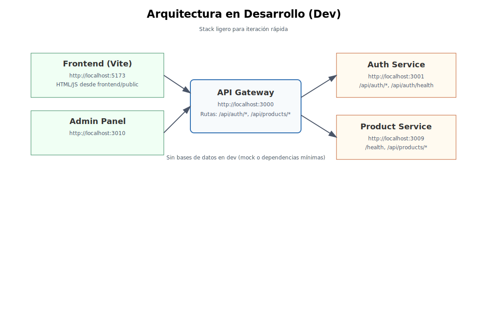
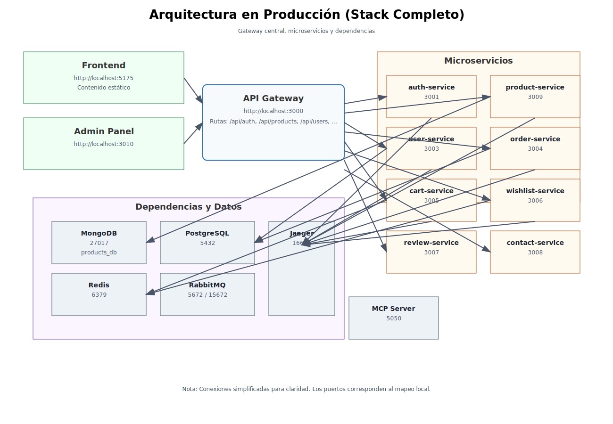

# Guía de Desarrollo - Flores Victoria

## Introducción

Esta guía explica cómo configurar y trabajar con el entorno de desarrollo del proyecto Flores Victoria. El proyecto utiliza una arquitectura de microservicios con múltiples tecnologías frontend y backend.

## Requisitos Previos

- Docker y Docker Compose
- Node.js (versión 16 o superior)
- npm o yarn
- Git

## Estructura del Proyecto

```
flores-victoria/
├── admin-panel/           # Panel de administración (React)
├── frontend/              # Tienda online (Vite)
├── microservices/         # Microservicios backend
│   ├── api-gateway/       # Gateway de la API
│   ├── auth-service/      # Servicio de autenticación
│   ├── cart-service/      # Servicio del carrito
│   ├── contact-service/   # Servicio de contacto
│   ├── order-service/     # Servicio de órdenes
│   ├── product-service/   # Servicio de productos
│   ├── review-service/    # Servicio de reseñas
│   ├── user-service/      # Servicio de usuarios
│   └── wishlist-service/  # Servicio de lista de deseos
├── monitoring/            # Configuración de monitoreo
└── shared/                # Código compartido entre microservicios
```

## Modos de Ejecución

## Diagramas de Arquitectura

Arquitectura en desarrollo (stack ligero):



Arquitectura en producción (stack completo):



---

### Modo Producción

Este modo construye y ejecuta todos los servicios tal como se ejecutarían en producción:

```bash
./start-all.sh
```

Este comando:
1. Construye todas las imágenes Docker
2. Crea y ejecuta todos los contenedores
3. Sirve los frontends a través de nginx desde archivos estáticos

Los servicios estarán disponibles en:
- Tienda online: http://localhost:5175
- Panel de administración: http://localhost:3010
- API Gateway: http://localhost:3000

### Modo Desarrollo

Este modo proporciona un entorno de desarrollo con Hot Module Replacement (HMR) usando docker-compose.dev.yml y scripts npm:

```bash
npm run dev:up        # Levantar sin rebuild
# o
npm run dev:stack     # Levantar con --build
```

Servicios en desarrollo:
- Tienda online (Vite): http://localhost:5173
- Panel de administración: http://localhost:3010
- API Gateway: http://localhost:3000
- Auth Service: http://localhost:3001
- Product Service: http://localhost:3009

Comandos útiles:
```bash
npm run dev:ps             # Estado de servicios
npm run dev:logs           # Logs de todos
npm run dev:logs:gateway   # Logs solo gateway
npm run dev:restart:auth   # Reiniciar auth-service
npm run dev:down           # Detener todo
npm run dev:clean          # Limpiar volúmenes y huérfanos
```

## Desarrollo Frontend

### Tienda Online (frontend)

Ubicación: `./frontend/`

Tecnologías:
- Vite
- JavaScript/TypeScript
- TailwindCSS

Para trabajar exclusivamente en el frontend:
```bash
cd frontend
npm run dev
```

### Panel de Administración (admin-panel)

Ubicación: `./admin-panel/`

Tecnologías:
- Vite
- JavaScript/TypeScript
- TailwindCSS

Para trabajar exclusivamente en el panel de administración:
```bash
cd admin-panel
npm run dev
```

## Desarrollo Backend

### Microservicios

Cada microservicio se puede ejecutar independientemente:

```bash
cd microservices/product-service
npm start
```

### API Gateway

El API Gateway se encuentra en `./microservices/api-gateway/` y es responsable de enrutar las solicitudes a los microservicios correspondientes.

## Pruebas

### Pruebas Unitarias

Para ejecutar pruebas unitarias en un microservicio específico:
```bash
cd microservices/product-service
npm test
```

### Pruebas End-to-End

Las pruebas E2E se pueden ejecutar con Cypress:
```bash
cd frontend
npm run test:e2e
```

## Monitorización

### Prometheus

Prometheus está disponible en http://localhost:9090

### Grafana

Grafana está disponible en http://localhost:3009

### Jaeger (Tracing)

Jaeger está disponible en http://localhost:16686

## Solución de Problemas

### Problemas Comunes

1. **Puertos ocupados**: Asegúrate de que los puertos requeridos no estén en uso por otras aplicaciones.

2. **Problemas de red Docker**: Si los contenedores no pueden comunicarse, intenta reiniciar Docker o ejecutar:
   ```bash
   docker network prune
   ```

3. **Errores de dependencias**: Si hay problemas con las dependencias de Node.js:
   ```bash
   rm -rf node_modules package-lock.json
   npm install
   ```

### Logs

Para ver los logs de un servicio específico:
```bash
docker compose logs <nombre-del-servicio>
```

Por ejemplo:
```bash
docker compose logs product-service
```

## Mejores Prácticas

1. **Commits atómicos**: Realiza commits pequeños y con mensajes descriptivos.

2. **Nombres de ramas**: Usa nombres descriptivos para las ramas de git:
   - `feature/nueva-funcionalidad`
   - `bugfix/correccion-error`
   - `hotfix/correccion-urgente`

3. **Variables de entorno**: No commitees secretos o credenciales. Usa variables de entorno.

4. **Pruebas**: Escribe pruebas para nuevas funcionalidades y corre las pruebas existentes.

5. **Documentación**: Actualiza la documentación cuando se modifica la funcionalidad.