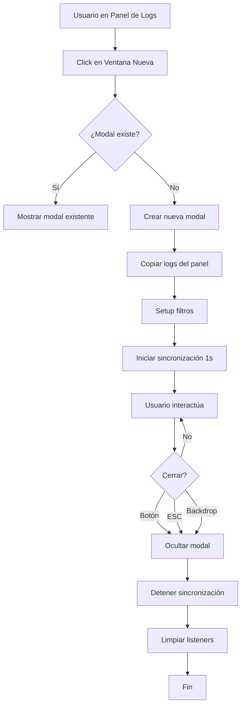

# 🎯 Guía Rápida: Ventana de Logs

**¿Cómo usar la nueva ventana modal de logs?**

---

## 🚀 Inicio Rápido

### 1️⃣ Abrir la Ventana de Logs

**Ubicación**: Panel de Logs → Controles

```
┌────────────────────────────────────┐
│ 🔍 Controles de Logs               │
│                                    │
│ [🗗 Ventana Nueva] ← Click aquí!   │
└────────────────────────────────────┘
```

**Resultado**: Se abre una ventana modal de pantalla completa

---

## 🖼️ Anatomía de la Ventana

```
╔═══════════════════════════════════════════════════════╗
║ 📋 Logs - Ventana Expandida [DEV]        [✕ Cerrar]  ║  ← Header
╠═══════════════════════════════════════════════════════╣
║ [🔍 Buscar] [Nivel ▼] [Servicio ▼] Total: 42 Vis: 15 ║  ← Filtros
╠═══════════════════════════════════════════════════════╣
║                                                       ║
║  [2025-10-25 14:30:00] DEV INFO - API Gateway...     ║
║  [2025-10-25 14:29:55] DEV DEBUG - Webpack: Hot...   ║
║  [2025-10-25 14:29:50] DEV WARN - Memory: Heap...    ║  ← Logs
║  [2025-10-25 14:29:45] DEV INFO - NPM: Installing... ║
║                                                       ║
║                    (scroll para más)                  ║
╚═══════════════════════════════════════════════════════╝
```

---

## 🎮 Controles Disponibles

### 🔍 Búsqueda
```
[🔍 Buscar en logs...]
       ↓
  Escribir: "error"
       ↓
  Muestra solo logs con "error"
```

### 📊 Filtro por Nivel
```
[Todos los niveles ▼]
        ↓
   Click → Opciones:
   • Todos
   • DEBUG (azul)
   • INFO (verde)
   • WARN (naranja)
   • ERROR (rojo)
```

### 🔧 Filtro por Servicio
```
[Todos los servicios ▼]
        ↓
   Click → Opciones:
   • Todos
   • API Gateway
   • Auth Service
   • Order Service
   • Payment Service
   • AI Service
   • Admin Panel
   • System
```

---

## 🚪 Cómo Cerrar la Ventana

### Método 1: Botón Cerrar
```
Click en [✕ Cerrar] → Ventana se cierra
```

### Método 2: Tecla ESC
```
Presionar ESC → Ventana se cierra
```

### Método 3: Click en Fondo Oscuro
```
Click fuera de la ventana → Ventana se cierra
```

---

## 💡 Casos de Uso

### 📌 Análisis de Errores
```
1. Abrir ventana
2. Filtro Nivel → ERROR
3. Buscar: "payment"
4. Analizar errores de pagos
5. Cerrar con ESC
```

### 📌 Monitoreo en Segundo Monitor
```
1. Abrir ventana
2. Arrastrar navegador a segundo monitor
3. Logs se actualizan cada 1 segundo
4. Trabajar en monitor principal
5. Monitorear logs en segundo monitor
```

### 📌 Debugging de Servicio Específico
```
1. Abrir ventana
2. Servicio → API Gateway
3. Nivel → WARN
4. Ver solo advertencias de API
5. Resolver problemas
```

### 📌 Presentación/Demo
```
1. Compartir pantalla
2. Abrir ventana de logs
3. Filtrar por servicio relevante
4. Mostrar logs en tiempo real
5. Cerrar con click en fondo
```

---

## ⚡ Características Especiales

### 🔄 Sincronización Automática
```
Stream Principal ──┐
                   ├──> Cada 1 segundo
Ventana Modal   ───┘
```
Los logs se copian automáticamente del panel principal a la ventana

### 🎯 Filtros Independientes
```
Panel Principal: [Nivel: ALL] [Servicio: ALL]
     vs
Ventana Modal:   [Nivel: ERROR] [Servicio: API]
```
Los filtros de la ventana NO afectan el panel principal

### 📊 Contadores en Tiempo Real
```
Total: 42     ← Logs totales en la ventana
Visibles: 15  ← Logs que pasan los filtros
```

---

## 🎨 Ventajas Visuales

### Antes (Panel Normal)
```
┌─────────────────┐
│ Sidebar │ Logs  │  ← Espacio limitado
│         │       │
│         │ [log] │
│         │ [log] │
└─────────────────┘
```

### Después (Ventana Modal)
```
╔═══════════════════════════════╗
║                               ║
║         LOGS COMPLETOS        ║  ← Pantalla completa
║                               ║
║  [log] [log] [log] [log]      ║
║  [log] [log] [log] [log]      ║
║  [log] [log] [log] [log]      ║
║                               ║
╚═══════════════════════════════╝
```

---

## ⌨️ Atajos de Teclado

| Tecla | Acción |
|-------|--------|
| `ESC` | Cerrar ventana |

*(Más atajos en futuras versiones)*

---

## 🔥 Tips Pro

### Tip 1: Combinar Filtros
```
Búsqueda: "timeout"
    +
Nivel: WARN
    +
Servicio: API
    =
Solo advertencias de timeout en API Gateway
```

### Tip 2: Usar en Segunda Pantalla
```
Monitor 1: Desarrollo/Código
Monitor 2: Ventana de Logs (sincronizada)
    ↓
Productividad++
```

### Tip 3: Análisis Rápido
```
1. Abrir ventana (Ctrl+Click en "Ventana Nueva")
2. Buscar keyword
3. Analizar
4. ESC para cerrar
   ↓
Total: < 10 segundos
```

---

## ❓ FAQ

### ¿Los logs se actualizan automáticamente?
✅ Sí, cada 1 segundo se sincronizan con el panel principal

### ¿Puedo usar filtros diferentes que en el panel?
✅ Sí, los filtros son completamente independientes

### ¿Se puede abrir más de una ventana?
❌ No, solo una ventana a la vez (reabre la existente)

### ¿Los logs se pierden al cerrar la ventana?
❌ No, siguen en el panel principal

### ¿Funciona en móvil?
✅ Sí, pero se recomienda usar en desktop para mejor experiencia

### ¿Consume muchos recursos?
❌ No, sync cada 1s es muy eficiente

---

## 🎓 Ejemplos Paso a Paso

### Ejemplo 1: Encontrar Error Específico
```
Paso 1: Click en [🗗 Ventana Nueva]
Paso 2: En búsqueda escribir "failed"
Paso 3: Filtro Nivel → ERROR
Paso 4: Revisar logs filtrados
Paso 5: Presionar ESC para cerrar
```

### Ejemplo 2: Monitorear Deployment
```
Paso 1: Cambiar entorno a "Production"
Paso 2: Abrir ventana de logs
Paso 3: Servicio → Deploy
Paso 4: Observar progreso en tiempo real
Paso 5: Cerrar cuando deployment complete
```

### Ejemplo 3: Debug de Testing
```
Paso 1: Entorno → Testing
Paso 2: Abrir ventana
Paso 3: Servicio → Jest
Paso 4: Nivel → ERROR
Paso 5: Identificar tests fallidos
```

---

## 📏 Dimensiones

```
Ancho máximo:  1400px
Altura máxima: 90% del viewport
Padding:       16px
Z-index:       10000 (siempre visible)
```

---

## 🎬 Flujo Completo



---

## 🌟 Resumen

### Lo que DEBES saber:
1. ✅ Click en "🗗 Ventana Nueva" para abrir
2. ✅ Se actualiza automáticamente cada 1 segundo
3. ✅ Tiene filtros independientes del panel
4. ✅ Cerrar con ESC, botón, o click fuera

### Lo que es GENIAL:
1. 🎯 Vista completa sin distracciones
2. 🔄 Sincronización en tiempo real
3. 🎨 Diseño profesional y limpio
4. ⚡ Super rápido y eficiente

---

**¿Listo para probar?**

```
👉 Ve al Admin Panel
👉 Sección Logs
👉 Click en [🗗 Ventana Nueva]
👉 ¡Disfruta!
```

---

**Versión**: 4.0.2  
**Fecha**: 25 Octubre 2025  
**Estado**: 🚀 Activo
