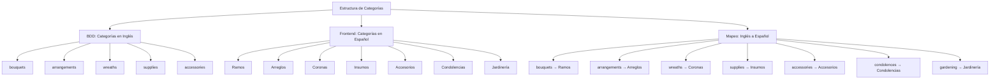

# Estructura de Datos de Categorías

## Diagrama de Estructura



## Representación de Datos

### En la Base de Datos (MongoDB)
```json
{
  "products": [
    {
      "name": "Ramo de Rosas Rojas",
      "category": "bouquets",
      "image_url": "/assets/images/products/bouquets.jpg"
    },
    {
      "name": "Arreglo Floral Premium",
      "category": "arrangements",
      "image_url": "/assets/images/products/arrangements.jpg"
    },
    {
      "name": "Corona de Flores Elegante",
      "category": "wreaths",
      "image_url": "/assets/images/products/wreaths.jpg"
    }
  ]
}
```

### En el Componente Frontend (Products.js)
```javascript
// Categorías predefinidas en lugar de cargar desde la API
this.categories = [
  'Ramos',
  'Arreglos',
  'Coronas',
  'Insumos',
  'Accesorios',
  'Condolencias',
  'Jardinería'
];

// Mapeo de categorías de la API a nombres en español
this.categoryMapping = {
  'bouquets': 'Ramos',
  'arrangements': 'Arreglos',
  'wreaths': 'Coronas',
  'supplies': 'Insumos',
  'accessories': 'Accesorios',
  'condolences': 'Condolencias',
  'gardening': 'Jardinería'
};
```

### En la Interfaz de Usuario
```html
<!-- Selector de categorías -->
<select class="filter-select" id="categoryFilter">
  <option value="all">Todas las categorías</option>
  <option value="Ramos">Ramos</option>
  <option value="Arreglos">Arreglos</option>
  <option value="Coronas">Coronas</option>
  <!-- ... más opciones ... -->
</select>

<!-- Productos organizados por categorías -->
<div class="category-section">
  <h2 class="category-title">Ramos</h2>
  <div class="products-grid">
    <!-- Productos de la categoría 'Ramos' -->
  </div>
</div>

<div class="category-section">
  <h2 class="category-title">Arreglos</h2>
  <div class="products-grid">
    <!-- Productos de la categoría 'Arreglos' -->
  </div>
</div>
```

## Flujo de Transformación de Datos

1. **Base de Datos** → **API de Productos**
   - Los productos se almacenan con categorías en inglés
   - La API devuelve los productos sin modificar

2. **API de Productos** → **Frontend**
   - El frontend recibe los productos con categorías en inglés
   - Se aplica el mapeo de categorías para traducir al español

3. **Frontend** → **Interfaz de Usuario**
   - Las categorías en español se muestran en el selector
   - Los productos se agrupan y muestran por categorías en español