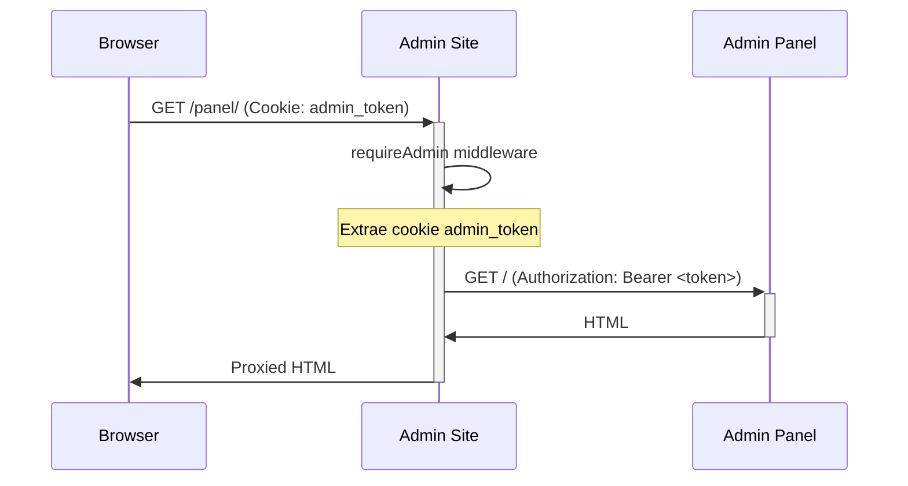
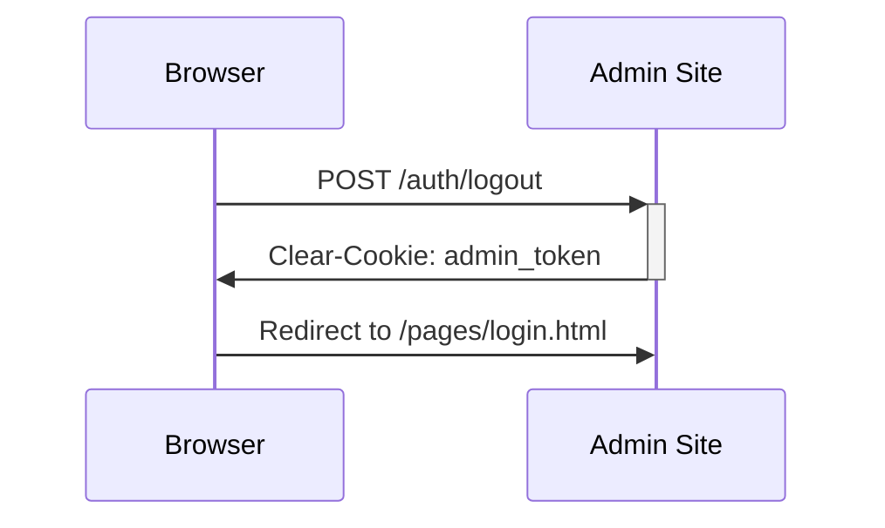

# Admin Site SSO - Guía Completa

**Flores Victoria - Sistema de Administración con Reverse Proxy y Single Sign-On**

---

## 📋 Tabla de Contenidos

1. [Resumen Ejecutivo](#resumen-ejecutivo)
2. [Arquitectura](#arquitectura)
3. [Componentes](#componentes)
4. [Flujo de Autenticación](#flujo-de-autenticación)
5. [Endpoints del Proxy](#endpoints-del-proxy)
6. [Configuración](#configuración)
7. [Seguridad](#seguridad)
8. [Uso](#uso)
9. [Troubleshooting](#troubleshooting)
10. [Extensión y Desarrollo](#extensión-y-desarrollo)

---

## Resumen Ejecutivo

El **Admin Site** es una aplicación Node.js/Express que actúa como:
- **Reverse Proxy** para servicios backend (Gateway, Admin Panel, MCP)
- **Single Sign-On (SSO)** usando cookies HttpOnly con JWT
- **Dashboard centralizado** para administración y monitoreo

### Ventajas

✅ **Same-Origin Policy**: Panel integrado sin CORS  
✅ **Cookie HttpOnly**: Protección contra XSS  
✅ **Rate Limiting**: Protección contra ataques de fuerza bruta  
✅ **Seguridad**: Helmet, validación de roles, timeout configurables  
✅ **Health Checks**: Monitoreo de conectividad de todos los servicios  

---

## Arquitectura

```
┌─────────────────┐
│   Browser       │
│  localhost:9000 │
└────────┬────────┘
         │
         ▼
┌────────────────────────────────────────┐
│   Admin Site (Express + Proxy)         │
│   - Middleware: helmet, rate-limit     │
│   - Auth: JWT cookie validation        │
│   - Static: HTML/CSS/JS                │
│   - Routes: /auth, /health, /panel...  │
└────────┬───────────────────────────────┘
         │
         ├──────────► /api/*    ──► Gateway (3000)
         ├──────────► /panel/*  ──► Admin Panel (3010)
         ├──────────► /mcp/*    ──► MCP Server (5050)
         └──────────► static     ──► /admin-site/index.html
```

### Flujo de Comunicación

1. **Usuario** accede a `localhost:9000/pages/login.html`
2. **Login** valida credenciales contra Gateway (3000)
3. **Server** valida token y setea cookie `admin_token` (HttpOnly)
4. **Proxy** inyecta `Authorization: Bearer <token>` en requests upstream
5. **Same-origin**: Panel en iframe `/panel/` sin problemas CORS

---

## Componentes

### 1. Express Server (`admin-site/server.js`)

**Responsabilidades:**
- Servir archivos estáticos (HTML, CSS, JS)
- Proxy reverso con inyección de auth headers
- Endpoints de autenticación (`/auth/set-cookie`, `/auth/logout`)
- Health checks (`/health`)
- Seguridad (helmet, rate limiting, CORS)

**Tecnologías:**
- `express`: Framework web
- `helmet`: Headers de seguridad HTTP
- `express-rate-limit`: Protección rate limiting
- `http-proxy-middleware`: Proxy reverso
- `cookie-parser`: Manejo de cookies
- `morgan`: Logging HTTP

### 2. Frontend (`admin-site/pages/`, `admin-site/js/`)

**Archivos clave:**
- `index.html`: Dashboard principal con tarjetas de navegación
- `pages/login.html`: Formulario de login con validación de rol admin
- `pages/admin-panel.html`: Iframe integrado al panel 3010 vía `/panel/`
- `pages/monitoring-dashboard.html`: Dashboard de monitoreo (copiado)
- `pages/mcp-dashboard.html`: Dashboard MCP (copiado)
- `js/auth.js`: Validación de sesión, logout, migración localStorage→cookie
- `js/main.js`: Stats, uptime, shortcuts
- `css/admin.css`: Estilos centralizados

### 3. Servicios Proxied

| Servicio       | Puerto | Ruta Proxy      | Descripción                          |
|----------------|--------|-----------------|--------------------------------------|
| API Gateway    | 3000   | `/api/*`        | Auth, Products, Orders, etc.         |
| Admin Panel    | 3010   | `/panel/*`      | Panel de control tradicional         |
| MCP Server     | 5050   | `/mcp/*`        | Model Context Protocol monitoring    |

---

## Flujo de Autenticación

### Login

```mermaid
sequenceDiagram
    Browser->>+Admin Site: POST /pages/login.html (email, password)
    Admin Site->>+Gateway: POST /api/auth/login
    Gateway->>-Admin Site: 200 {token}
    Admin Site->>+Admin Site: POST /auth/set-cookie {token}
    Admin Site->>+Gateway: GET /api/auth/profile (Bearer token)
    Gateway->>-Admin Site: {user: {role: 'admin'}}
    Admin Site->>-Browser: Set-Cookie: admin_token=JWT; HttpOnly
    Browser->>Admin Site: Redirect to /
```

**Pasos:**
1. Usuario envía credenciales a `login.html` (JS)
2. Fetch a Gateway `/api/auth/login` retorna JWT
3. Fetch a `/auth/set-cookie` con el token:
   - Valida token contra Gateway `/api/auth/profile`
   - Verifica `user.role === 'admin'`
   - Setea cookie `admin_token` (HttpOnly, SameSite=Lax, maxAge=24h)
4. Redirect a home del admin-site

### Acceso Protegido



**Middleware `requireAdmin`:**
- Verifica existencia de cookie `admin_token`
- Si no existe → redirige a `/pages/login.html`
- Si existe → permite acceso y pasa a proxy

**Función `onProxyReq`:**
- Lee cookie `admin_token`
- Inyecta header `Authorization: Bearer <token>` al upstream
- Backend valida JWT sin saber que vino de cookie

### Logout



**Pasos:**
1. Usuario clickea logout
2. JS llama `POST /auth/logout`
3. Server limpia cookie con `res.clearCookie('admin_token')`
4. Cliente borra localStorage (legacy) y redirige a login

---

## Endpoints del Proxy

### Públicos

| Método | Ruta                 | Descripción                               |
|--------|----------------------|-------------------------------------------|
| GET    | `/`                  | Dashboard principal (index.html)          |
| GET    | `/pages/login.html`  | Formulario de login                       |
| POST   | `/auth/set-cookie`   | Setea cookie HttpOnly tras validar token  |
| POST   | `/auth/logout`       | Limpia cookie de sesión                   |
| GET    | `/health`            | Health check de admin-site + servicios    |

### Protegidos (requieren `admin_token` cookie)

| Método | Ruta          | Upstream                 | Descripción                   |
|--------|---------------|--------------------------|-------------------------------|
| *      | `/api/*`      | `http://localhost:3000`  | Gateway (auth, products, etc.)|
| *      | `/panel/*`    | `http://localhost:3010`  | Admin Panel integrado         |
| *      | `/mcp/*`      | `http://localhost:5050`  | MCP Server                    |

**Configuración de Proxy:**
- `changeOrigin: true`: Preserva host original
- `pathRewrite`: Reescribe path antes de enviar upstream
- `onProxyReq`: Inyecta Authorization header
- `onError`: Maneja errores (502 con mensaje amigable)
- `proxyTimeout: 30000`: Timeout 30s

---

## Configuración

### Variables de Entorno

| Variable       | Default | Descripción                          |
|----------------|---------|--------------------------------------|
| `PORT`         | 9000    | Puerto del admin-site                |
| `NODE_ENV`     | -       | `production` activa cookie Secure    |

### Puertos

| Servicio         | Puerto |
|------------------|--------|
| Admin Site       | 9000   |
| API Gateway      | 3000   |
| Auth Service     | 3001   |
| Product Service  | 3009   |
| Admin Panel      | 3010   |
| MCP Server       | 5050   |
| Frontend         | 5173   |

### Rate Limiting

**Admin Site (proxy routes):**
- Window: 60 segundos
- Max: 600 requests

**Gateway:**
- Window: 15 minutos
- Max: 500 requests (aumentado de 100 para dev/testing)

**Auth Service:**
- Window: 15 minutos
- Max: 200 requests (aumentado de 50 para dev/testing)

---

## Seguridad

### Headers (Helmet)

- `Content-Security-Policy`: Disabled (para permitir iframes)
- Resto de headers: Habilitados (XSS, MIME sniffing, etc.)

### Cookies

**Flags:**
- `httpOnly: true` → No accesible desde JS (protección XSS)
- `secure: true` → Solo HTTPS (producción)
- `sameSite: 'lax'` → Protección CSRF
- `maxAge: 24h` → Expiración

### CORS

Configurado para aceptar requests desde `localhost:*` con credentials:
- `Access-Control-Allow-Origin`: Origin del request
- `Access-Control-Allow-Credentials: true`
- `Access-Control-Allow-Methods`: GET, POST, PUT, DELETE, OPTIONS
- `Access-Control-Allow-Headers`: Content-Type, Authorization

### Validación de Roles

El endpoint `/auth/set-cookie`:
1. Valida JWT contra Gateway `/api/auth/profile`
2. Verifica que `user.role === 'admin'`
3. Solo entonces setea cookie

Rutas `/panel`, `/mcp`, `/api` protegidas por `requireAdmin` middleware.

### Error Handling

Proxy captura errores (ECONNREFUSED, timeout) y retorna 502 con mensaje:
```json
{
  "error": "Servicio no disponible",
  "detail": "No se pudo conectar al servicio"
}
```

---

## Uso

### Inicio Rápido

**Scripts automatizados:**
```bash
# Iniciar todo (Docker + MCP + Admin Site)
./scripts/start-all-with-admin.sh

# Detener todo
./scripts/stop-all-with-admin.sh
```

**Manual (desarrollo):**
```bash
# 1. Docker services
docker compose -f docker-compose.dev-simple.yml up -d

# 2. MCP Server
cd mcp-server && node server.js &

# 3. Admin Site
cd admin-site && npm run start
```

### Acceso

1. **Home:** http://localhost:9000
2. **Login:** http://localhost:9000/pages/login.html
   - Credenciales: `admin@flores.local` / `admin123`
3. **Panel Integrado:** http://localhost:9000/pages/admin-panel.html
4. **MCP Dashboard:** http://localhost:9000/pages/mcp-dashboard.html
5. **Monitoring:** http://localhost:9000/pages/monitoring-dashboard.html

### Testing Login

```bash
# 1. Verificar servicios levantados
curl http://localhost:9000/health | jq

# 2. Login (obtener token)
curl -X POST http://localhost:3000/api/auth/login \
  -H "Content-Type: application/json" \
  -d '{"email":"admin@flores.local","password":"admin123"}' | jq

# 3. Setear cookie via admin-site
TOKEN="<jwt_aquí>"
curl -X POST http://localhost:9000/auth/set-cookie \
  -H "Content-Type: application/json" \
  -d "{\"token\":\"$TOKEN\"}" \
  -c cookies.txt

# 4. Acceder a ruta protegida con cookie
curl http://localhost:9000/panel/ -b cookies.txt
```

---

## Troubleshooting

### Error 429 (Too Many Requests)

**Causa:** Rate limit alcanzado en Gateway o Auth Service.

**Solución:**
- Aumentar `max` en `microservices/api-gateway/src/config/index.js` (actualmente 500)
- Aumentar `max` en `microservices/auth-service/src/config/index.js` (actualmente 200)
- Recrear contenedores: `docker compose up -d --force-recreate api-gateway auth-service`

### Error 502 (Bad Gateway)

**Causa:** Servicio upstream (3000, 3010, 5050) no disponible.

**Diagnóstico:**
```bash
# Health check completo
curl http://localhost:9000/health | jq

# Verificar puertos
netstat -tuln | grep -E ":(3000|3010|5050|9000)"

# Logs del proxy
tail -f /tmp/admin-site.log

# Logs de servicios
docker compose logs -f api-gateway
docker compose logs -f admin-panel
```

**Solución:**
- Levantar servicios: `./scripts/start-all-with-admin.sh`
- Verificar Docker: `docker compose ps`

### Cookie no se setea

**Causa:** Browser bloqueando cookies de terceros o HttpOnly flag.

**Diagnóstico:**
1. Abrir DevTools → Application → Cookies → `http://localhost:9000`
2. Verificar que existe `admin_token` con flags `HttpOnly` y `SameSite=Lax`

**Solución:**
- Asegurar que login usa `/auth/set-cookie` (no `setCookie` en JS)
- Verificar que `fetch` incluye `credentials: 'include'`

### Iframe no carga panel

**Causa:** CORS o servicio 3010 down.

**Diagnóstico:**
```bash
# Verificar panel directo
curl http://localhost:3010

# Verificar proxy
curl http://localhost:9000/panel/ -b cookies.txt
```

**Solución:**
- Verificar que `admin-panel.html` usa `src="/panel/"` (no `http://localhost:3010`)
- Verificar cookie `admin_token` está presente

### Redirect loop (login → home → login)

**Causa:** Token inválido o expirado, o middleware `checkAuth` falla.

**Diagnóstico:**
- Console del browser: errores de fetch a `/api/auth/profile`
- Network tab: verificar status codes

**Solución:**
- Limpiar cookies: DevTools → Application → Clear storage
- Re-login
- Verificar que Gateway retorna `user.role === 'admin'`

---

## Extensión y Desarrollo

### Agregar Nuevo Servicio al Proxy

**Ejemplo:** Proxiar servicio de Orders en puerto 3004

1. **Agregar ruta en `server.js`:**
```javascript
app.use('/orders', requireAdmin, createProxyMiddleware({
  target: 'http://localhost:3004',
  changeOrigin: true,
  pathRewrite: { '^/orders': '/' },
  onProxyReq,
  onError: onProxyError,
  proxyTimeout: 30000,
}));
```

2. **Actualizar health check:**
```javascript
checks.orders = { url: 'http://localhost:3004/health', ok: false };
```

3. **Agregar tarjeta en `index.html`:**
```html
<div class="dashboard-card">
  <div class="card-icon">📦</div>
  <h3>Órdenes</h3>
  <p>Gestión de pedidos</p>
  <a href="/orders/" class="card-link">Abrir →</a>
</div>
```

4. **Reiniciar admin-site:**
```bash
lsof -ti:9000 | xargs kill -9
cd admin-site && npm run start
```

### Modificar Timeout de Proxy

En `server.js`, ajustar `proxyTimeout`:
```javascript
proxyTimeout: 60000, // 60s
```

### Cambiar Puerto del Admin Site

**Opción 1: Variable de entorno**
```bash
PORT=8080 npm run start
```

**Opción 2: En `server.js`**
```javascript
const PORT = process.env.PORT || 8080;
```

### Habilitar Logs Detallados

Morgan ya está configurado en `dev` mode. Para producción:
```javascript
app.use(morgan('combined'));
```

### Agregar Middleware Personalizado

Ejemplo: Rate limit más estricto para `/api/auth/login`:
```javascript
const loginLimiter = rateLimit({ windowMs: 60 * 1000, max: 5 });
app.use('/api/auth/login', loginLimiter);
```

### Integrar con CI/CD

**Docker Compose con Admin Site:**
Crear `docker-compose.admin.yml`:
```yaml
version: '3.8'
services:
  admin-site:
    build: ./admin-site
    ports:
      - "9000:9000"
    environment:
      - NODE_ENV=production
      - PORT=9000
    depends_on:
      - api-gateway
      - admin-panel
      - mcp-server
```

**Build:**
```dockerfile
# admin-site/Dockerfile
FROM node:18-alpine
WORKDIR /app
COPY package*.json ./
RUN npm ci --only=production
COPY . .
EXPOSE 9000
CMD ["node", "server.js"]
```

---

## Referencias

- **Proyecto:** Flores Victoria (e-commerce)
- **Repo:** `laloaggro/Flores-Victoria-`
- **Branch:** `main`
- **Fecha:** Octubre 2025

### Archivos Clave

- `admin-site/server.js`: Servidor Express con proxy
- `admin-site/pages/login.html`: Formulario de login
- `admin-site/js/auth.js`: Validación de sesión
- `scripts/start-all-with-admin.sh`: Script de inicio
- `scripts/stop-all-with-admin.sh`: Script de detención
- `microservices/api-gateway/src/config/index.js`: Config rate limit Gateway
- `microservices/auth-service/src/config/index.js`: Config rate limit Auth

### Contacto

Para issues o mejoras, ver `admin-site/README.md` y `ADMIN_SITE_GUIDE.md`.

---

**© 2025 Flores Victoria - Admin Site SSO**
