# 🌸 Flores Victoria - Arquitectura Visual del Sistema

> Diagramas profesionales de la arquitectura de microservicios

---

## 📊 1. Diagrama de Arquitectura General

---

## 🔄 2. Flujo de Autenticación

```mermaid
sequenceDiagram
    autonumber
    participant U as 👤 Usuario
    participant F as 🌐 Frontend
    participant G as 🔀 API Gateway
    participant A as 🔑 Auth Service
    participant R as ⚡ Redis
    participant P as 🐘 PostgreSQL

    U->>F: Login (email, password)
    F->>G: POST /api/auth/login
    G->>A: Forward request
    A->>P: Verificar credenciales
    P-->>A: Usuario válido
    A->>A: Generar JWT + Refresh Token
    A->>R: Guardar sesión
    A-->>G: { token, refreshToken, user }
    G-->>F: Response 200
    F->>F: Guardar en localStorage
    F-->>U: ✅ Login exitoso

    Note over U,P: Flujo de Request Autenticado

    U->>F: Acceder a recurso protegido
    F->>G: GET /api/products (Bearer token)
    G->>G: Validar JWT
    G->>A: Verificar token (opcional)
    A->>R: Check blacklist
    R-->>A: Token válido
    A-->>G: ✅ Autorizado
    G->>G: Forward a servicio
```

---

## 🛒 3. Flujo de Compra (E-commerce)

```mermaid
flowchart TD
    subgraph "👤 Cliente"
        A[Navegar Catálogo] --> B[Ver Producto]
        B --> C{¿Agregar al Carrito?}
    end

    subgraph "🛍️ Carrito"
        C -->|Sí| D[Agregar Item]
        D --> E[Actualizar Carrito]
        E --> F{¿Checkout?}
    end

    subgraph "💳 Checkout"
        F -->|Sí| G[Validar Stock]
        G -->|OK| H[Calcular Total]
        H --> I[Aplicar Promociones]
        I --> J[Procesar Pago]
    end

    subgraph "📦 Fulfillment"
        J -->|Aprobado| K[Crear Orden]
        K --> L[Reservar Inventario]
        L --> M[Enviar Confirmación]
        M --> N[Notificar Cliente]
    end

    subgraph "❌ Errores"
        G -->|Sin Stock| O[Mostrar Error]
        J -->|Rechazado| P[Reintentar Pago]
        O --> B
        P --> J
    end

    style K fill:#4ade80
    style N fill:#4ade80
    style O fill:#ef4444
    style P fill:#f59e0b
```

---

## 🗄️ 4. Modelo de Datos

---

## 🚀 5. Pipeline de Despliegue (CI/CD)

```mermaid
flowchart LR
    subgraph "👨‍💻 Desarrollo"
        A[📝 Commit] --> B[🔀 Push to Main]
    end

    subgraph "🔄 CI Pipeline"
        B --> C[📋 Lint & Format]
        C --> D[🧪 Unit Tests]
        D --> E[🔒 Security Scan]
        E --> F[🏗️ Build Docker]
    end

    subgraph "📦 Registry"
        F --> G[🐳 Push to Registry]
    end

    subgraph "🚀 CD Pipeline"
        G --> H{🌍 Environment}
        H -->|Staging| I[🧪 Deploy Staging]
        H -->|Production| J[🚀 Deploy Production]
        I --> K[🔍 Integration Tests]
        K -->|Pass| J
        J --> L[✅ Health Checks]
    end

    subgraph "☁️ Railway"
        L --> M[🌐 Frontend]
        L --> N[🔀 API Gateway]
        L --> O[🔧 Microservices]
    end

    style A fill:#667eea
    style J fill:#4ade80
    style L fill:#4ade80
```

---

## 🔌 6. Comunicación entre Microservicios

---

## 📈 7. Métricas y Monitoreo

```mermaid
graph TB
    subgraph "🔧 Servicios"
        S1[API Gateway]
        S2[Auth Service]
        S3[Product Service]
        S4[Order Service]
    end

    subgraph "📊 Métricas"
        S1 -->|/metrics| P[Prometheus]
        S2 -->|/metrics| P
        S3 -->|/metrics| P
        S4 -->|/metrics| P
    end

    subgraph "📈 Visualización"
        P --> G[Grafana]
        G --> D1[📊 Dashboard<br/>Request Rate]
        G --> D2[⏱️ Dashboard<br/>Latency]
        G --> D3[❌ Dashboard<br/>Error Rate]
        G --> D4[💾 Dashboard<br/>Resources]
    end

    subgraph "🚨 Alertas"
        P --> AM[AlertManager]
        AM -->|Email| E[📧]
        AM -->|Slack| SL[💬]
        AM -->|PagerDuty| PD[📱]
    end

    subgraph "🔍 Tracing"
        S1 -->|Spans| J[Jaeger]
        S2 -->|Spans| J
        S3 -->|Spans| J
        J --> T[Trace Viewer]
    end
```

---

## 🏗️ 8. Estructura del Proyecto

```mermaid
mindmap
  root((🌸 Flores Victoria))
    Frontend
      HTML5/CSS3/JS
      PWA Support
      Responsive Design
      Service Worker
    Microservices
      API Gateway
        Rate Limiting
        Auth Middleware
        Request Routing
      Auth Service
        JWT Tokens
        RBAC
        Sessions
      Product Service
        CRUD
        Search
        Categories
      Order Service
        Checkout
        Payment
        Status
      Support Services
        Cart
        Wishlist
        Reviews
        Notifications
    Data Layer
      PostgreSQL
        Users
        Orders
        Auth
      MongoDB
        Products
        Reviews
      Redis
        Cache
        Sessions
    DevOps
      Docker
      Railway
      CI/CD
    Admin Panel
      Dashboard
      Analytics
      User Management
```

---

## 🎯 9. Resumen de Puertos y Servicios

| Servicio | Puerto | Tecnología | Base de Datos |
|----------|--------|------------|---------------|
| Frontend | 5173 | Vite/HTML/JS | - |
| API Gateway | 3000 | Express | Redis |
| Auth Service | 3001 | Express | PostgreSQL + Redis |
| User Service | 3002 | Express | PostgreSQL |
| Cart Service | 3004 | Express | Redis |
| Wishlist Service | 3005 | Express | PostgreSQL |
| Order Service | 3006 | Express | PostgreSQL |
| Review Service | 3007 | Express | MongoDB |
| Contact Service | 3008 | Express | MongoDB |
| Product Service | 3009 | Express | MongoDB |
| Admin Panel | 3010 | Express | - |
| Promotion Service | 3011 | Express | PostgreSQL |
| Payment Service | 3012 | Express | PostgreSQL |

---

## 📌 URLs de Producción (Railway)

| Servicio | URL |
|----------|-----|
| Frontend | https://frontend-v2-production-7508.up.railway.app |
| Admin Dashboard | https://admin-dashboard-service-production.up.railway.app |
| Auth Service | https://auth-service-production-ab8c.up.railway.app |
| API Gateway | https://api-gateway-production-xxxx.up.railway.app |

---

*Generado: Diciembre 2025*
