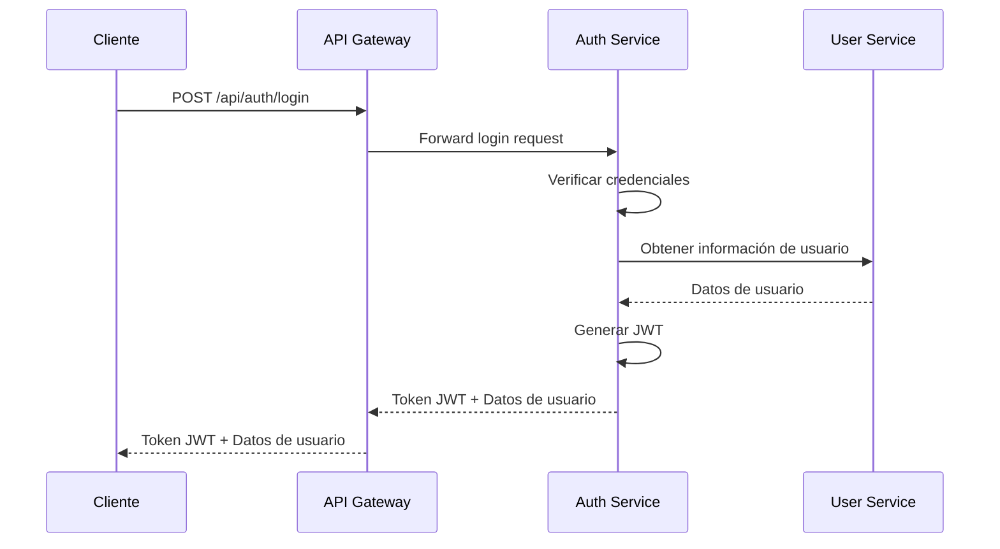

# Documentación Técnica Extendida - Flores Victoria

## Introducción

Este documento proporciona una visión técnica detallada del proyecto Flores Victoria, incluyendo arquitectura, patrones de diseño, diagramas y procedimientos de operación.

## Arquitectura del Sistema

### Diagrama de Arquitectura

```
                    +------------------+
                    |    Cliente       |
                    |   (Navegador)    |
                    +------------------+
                             |
                    +------------------+
                    |   API Gateway    |
                    |   (Puerto 3000)  |
                    +------------------+
                             |
      +----------------------+----------------------+
      |                      |                      |
+------------+       +--------------+       +-------------+
| Auth       |       | Product      |       | User        |
| Service    |       | Service      |       | Service     |
| (Puerto    |       | (Puerto      |       | (Puerto     |
| 3001)      |       | 3002)        |       | 3003)       |
+------------+       +--------------+       +-------------+
      |                      |                      |
      |               +--------------+       +-------------+
      |               | Order        |       | Cart        |
      |               | Service      |       | Service     |
      |               | (Puerto      |       | (Puerto     |
      |               | 3004)        |       | 3005)       |
      |               +--------------+       +-------------+
      |                      |                      |
      |               +--------------+       +-------------+
      |               | Wishlist     |       | Review      |
      |               | Service      |       | Service     |
      |               | (Puerto      |       | (Puerto     |
      |               | 3006)        |       | 3007)       |
      |               +--------------+       +-------------+
      |                      |                      |
      |               +--------------+              |
      |               | Contact      |              |
      |               | Service      |              |
      |               | (Puerto      |              |
      |               | 4007)        |              |
      |               +--------------+              |
      |                                              |
+-----+----------------------------------------------+-----+
|                   Message Broker (RabbitMQ)              |
|                        (Puerto 5673)                     |
+----------------------------------------------------------+
      |                                              |
+-----+--------+                              +------+-----+
| MongoDB      |                              | PostgreSQL |
| (Puerto      |                              | (Puerto    |
| 27018)       |                              | 5433)      |
+--------------+                              +------------+
```

### Patrones de Diseño Utilizados

#### 1. Microservicios
- **Ventajas**: Escalabilidad independiente, despliegue separado, tecnología diversa
- **Implementación**: Cada funcionalidad como un servicio separado con su propia base de datos

#### 2. API Gateway
- **Ventajas**: Enrutamiento centralizado, autenticación unificada, rate limiting
- **Implementación**: Servicio que enruta las solicitudes a los microservicios correspondientes

#### 3. Circuit Breaker
- **Ventajas**: Prevención de fallos en cascada, tolerancia a fallos
- **Implementación**: En servicios que dependen de otros servicios externos

#### 4. CQRS (Command Query Responsibility Segregation)
- **Ventajas**: Optimización de consultas y comandos por separado
- **Implementación**: En servicios con cargas de lectura y escritura diferentes

#### 5. Event Sourcing
- **Ventajas**: Auditoría completa, reconstrucción de estados
- **Implementación**: Para órdenes y procesos de negocio críticos

## Diagramas de Componentes

### Estructura de un Microservicio Típico

```
microservice/
├── Dockerfile
├── package.json
├── src/
│   ├── server.js
│   ├── app.js
│   ├── routes/
│   ├── controllers/
│   ├── models/
│   ├── middleware/
│   └── config/
├── tests/
│   ├── unit/
│   └── integration/
└── docs/
```

### Flujo de Autenticación



## Guía de Desarrollo

### Configuración del Entorno de Desarrollo

1. **Requisitos previos**:
   - Node.js >= 16
   - Docker y Docker Compose
   - MongoDB y PostgreSQL clientes
   - Git

2. **Clonar el repositorio**:
   ```bash
   git clone <repositorio-url>
   cd Flores-Victoria-
   ```

3. **Instalar dependencias**:
   ```bash
   # Instalar dependencias para cada microservicio
   for service in microservices/*/; do
     if [ -f "$service/package.json" ]; then
       echo "Instalando dependencias para ${service}"
       (cd "$service" && npm install)
     fi
   done
   ```

4. **Configurar variables de entorno**:
   ```bash
   cp .env.example .env
   # Editar .env con valores apropiados
   ```

5. **Iniciar servicios**:
   ```bash
   docker-compose up -d
   ```

### Estructura de Código

#### Convenciones de Nomenclatura
- Variables y funciones: camelCase
- Clases y constructores: PascalCase
- Constantes: UPPER_SNAKE_CASE
- Archivos: kebab-case

#### Estructura de Rutas
```javascript
// Ejemplo de estructura de rutas
const express = require('express');
const router = express.Router();
const { 
  getAllProducts, 
  getProductById, 
  createProduct, 
  updateProduct, 
  deleteProduct 
} = require('../controllers/productController');

// Middleware de autenticación
const { authenticate } = require('../middleware/auth');

// Rutas públicas
router.get('/', getAllProducts);
router.get('/:id', getProductById);

// Rutas protegidas
router.post('/', authenticate, createProduct);
router.put('/:id', authenticate, updateProduct);
router.delete('/:id', authenticate, deleteProduct);

module.exports = router;
```

### Pruebas

#### Pruebas Unitarias
```javascript
// Ejemplo de prueba unitaria
const { calculateTotal } = require('../utils/cart');

describe('Cart Utils', () => {
  test('should calculate total correctly', () => {
    const items = [
      { price: 10, quantity: 2 },
      { price: 15, quantity: 1 }
    ];
    
    const total = calculateTotal(items);
    expect(total).toBe(35);
  });
});
```

#### Pruebas de Integración
```javascript
// Ejemplo de prueba de integración
describe('Product API', () => {
  test('should get all products', async () => {
    const response = await request(app)
      .get('/api/products')
      .expect(200);
      
    expect(response.body).toBeInstanceOf(Array);
  });
});
```

## Procedimientos de Operación

### Despliegue

#### Despliegue en Staging
```bash
# Construir imágenes
docker-compose -f docker-compose.yml -f docker-compose.staging.yml build

# Iniciar servicios en staging
docker-compose -f docker-compose.yml -f docker-compose.staging.yml up -d
```

#### Despliegue en Producción
```bash
# Construir imágenes
docker-compose -f docker-compose.yml -f docker-compose.prod.yml build

# Iniciar servicios en producción
docker-compose -f docker-compose.yml -f docker-compose.prod.yml up -d
```

### Monitoreo

#### Verificar estado de servicios
```bash
# Verificar contenedores en ejecución
docker-compose ps

# Verificar logs de un servicio específico
docker-compose logs product-service

# Verificar uso de recursos
docker stats
```

#### Health Checks
```bash
# Verificar salud de servicios
curl -f http://localhost:3001/health
curl -f http://localhost:3002/health
curl -f http://localhost:3003/health
```

### Backup y Recuperación

#### Realizar backup
```bash
# Ejecutar script de backup
./scripts/backup-databases.sh
```

#### Restaurar backup
```bash
# Restaurar MongoDB
mongorestore --host localhost --port 27018 \
  --username $MONGO_INITDB_ROOT_USERNAME \
  --password $MONGO_INITDB_ROOT_PASSWORD \
  ./backups/mongodb/backup_YYYYMMDD_HHMMSS/

# Restaurar PostgreSQL
psql -h localhost -p 5433 \
  -U $POSTGRES_USER \
  -d $POSTGRES_DB \
  -f ./backups/postgresql/backup_YYYYMMDD_HHMMSS.sql
```

## Solución de Problemas

### Problemas Comunes

#### 1. Servicios que no inician
- Verificar logs: `docker-compose logs <service-name>`
- Verificar puertos: `netstat -tulpn | grep <port>`
- Verificar variables de entorno

#### 2. Problemas de conexión a bases de datos
- Verificar credenciales
- Verificar redes Docker
- Verificar estado de contenedores de bases de datos

#### 3. Problemas de autenticación
- Verificar validez de tokens JWT
- Verificar configuración de claves
- Verificar middleware de autenticación

### Comandos de Diagnóstico Útiles

```bash
# Verificar estado de todos los servicios
docker-compose ps

# Verificar uso de recursos
docker stats

# Verificar logs en tiempo real
docker-compose logs -f

# Ejecutar comandos dentro de un contenedor
docker-compose exec product-service sh

# Verificar variables de entorno
docker-compose exec product-service env
```

## Mejores Prácticas

### Código
1. Escribir pruebas unitarias para todas las funciones críticas
2. Utilizar linter y formatter (ESLint, Prettier)
3. Seguir principios SOLID
4. Documentar código complejo con comentarios

### Seguridad
1. No almacenar secretos en el código
2. Validar y sanitizar todas las entradas
3. Utilizar HTTPS en producción
4. Implementar rate limiting

### Rendimiento
1. Utilizar caching apropiadamente
2. Optimizar consultas a bases de datos
3. Implementar paginación para grandes conjuntos de datos
4. Utilizar compresión HTTP

## Conclusión

Esta documentación proporciona una guía completa para desarrolladores, operadores y otros interesados en el proyecto Flores Victoria. Se recomienda mantener esta documentación actualizada a medida que el sistema evoluciona.