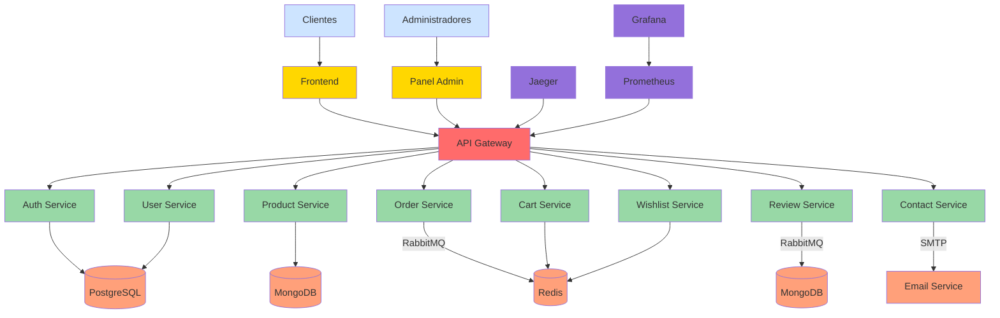

# Arquitectura General del Sistema

## Índice

1. [Descripción General](#descripción-general)
2. [Arquitectura de Microservicios](#arquitectura-de-microservicios)
3. [Diagrama de Arquitectura](#diagrama-de-arquitectura)
4. [Patrones de Diseño](#patrones-de-diseño)
5. [Tecnologías Principales](#tecnologías-principales)
6. [Flujos de Datos](#flujos-de-datos)

## Descripción General

Flores Victoria es una plataforma de comercio electrónico completa basada en microservicios para una florería. Utiliza tecnologías modernas como Node.js, Express, MongoDB, PostgreSQL y Docker para proporcionar una solución escalable y mantenible.

La arquitectura del sistema se basa en microservicios independientes que se comunican a través de una API Gateway. Cada microservicio tiene su propia base de datos y responsabilidades específicas, siguiendo el principio de separación de preocupaciones.

## Arquitectura de Microservicios

### Componentes Principales

1. **Frontend**: Interfaz de usuario para clientes
2. **Panel de Administración**: Interfaz para gestión administrativa
3. **API Gateway**: Punto de entrada único para todas las solicitudes
4. **Microservicios**: Servicios especializados para diferentes funciones
5. **Bases de Datos**: Almacenamiento de datos persistente
6. **Sistema de Mensajería**: Comunicación asíncrona entre servicios
7. **Monitorización**: Observabilidad del sistema

### Diagrama de Arquitectura

## Patrones de Diseño

### Patrones Arquitectónicos Implementados

1. **Microservicios**: Cada funcionalidad está encapsulada en un servicio independiente
2. **API Gateway**: Punto único de entrada para todas las solicitudes
3. **Circuit Breaker**: Prevención de fallos en cascada
4. **Load Balancing**: Distribución de carga entre instancias de servicios
5. **Caching**: Uso de Redis para mejorar el rendimiento
6. **Message Queue**: Comunicación asíncrona mediante RabbitMQ
7. **Database per Service**: Cada servicio tiene su propia base de datos

### Patrones de Integración

1. **Remote Procedure Call (RPC)**: Comunicación síncrona entre servicios
2. **Messaging**: Comunicación asíncrona mediante colas de mensajes
3. **Service Registry**: Descubrimiento dinámico de servicios
4. **Event Sourcing**: Almacenamiento de eventos para reconstrucción de estado

## Tecnologías Principales

### Backend
- **Lenguaje**: Node.js
- **Framework**: Express.js
- **Contenedores**: Docker
- **Orquestación**: Docker Compose, Kubernetes

### Bases de Datos
- **Relacional**: PostgreSQL
- **NoSQL**: MongoDB
- **Caché**: Redis

### Mensajería
- **Broker**: RabbitMQ

### Monitorización
- **Tracing**: Jaeger
- **Métricas**: Prometheus
- **Visualización**: Grafana

### Frontend
- **HTML5, CSS3, JavaScript**
- **Vite**: Para el frontend
- **Vanilla JS**: Para el panel de administración

## Flujos de Datos

### Flujo de Autenticación
1. Cliente envía credenciales al Frontend
2. Frontend envía solicitud a API Gateway
3. API Gateway enruta a Auth Service
4. Auth Service valida credenciales con PostgreSQL
5. Auth Service genera token JWT
6. Token se devuelve al cliente
7. Cliente usa token para solicitudes futuras

### Flujo de Compra
1. Cliente navega productos (Product Service)
2. Cliente agrega productos al carrito (Cart Service)
3. Cliente procede al checkout
4. Frontend crea pedido en Order Service
5. Order Service procesa pago
6. Order Service envía confirmación
7. Notificación se envía a través de RabbitMQ
8. Sistema de notificaciones procesa mensaje
9. Cliente recibe confirmación

### Flujo de Administración
1. Administrador accede al Panel Admin
2. Panel Admin solicita datos a API Gateway
3. API Gateway enruta a servicios correspondientes
4. Servicios devuelven datos desde sus bases de datos
5. Panel Admin muestra información
6. Administrador realiza cambios
7. Cambios se envían a través de API Gateway
8. API Gateway enruta a servicios correspondientes
9. Servicios actualizan sus bases de datos