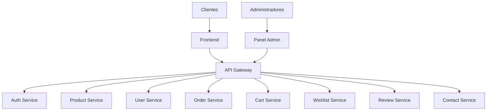

# Automatización de Documentación

## Índice

1. [Introducción](#introducción)
2. [Generación Automática de Documentación de APIs](#generación-automática-de-documentación-de-apis)
3. [Documentación de Código Fuente](#documentación-de-código-fuente)
4. [Generación de Diagramas](#generación-de-diagramas)
5. [Integración con CI/CD](#integración-con-cicd)
6. [Herramientas Recomendadas](#herramientas-recomendadas)
7. [Mejores Prácticas](#mejores-prácticas)

## Introducción

La automatización de documentación es fundamental para mantener la consistencia y actualización de la documentación del proyecto Flores Victoria. Este documento describe las herramientas y procesos para automatizar la generación de documentación técnica.

## Generación Automática de Documentación de APIs

### OpenAPI/Swagger

Implementar OpenAPI para generar documentación de APIs automáticamente:

1. **Instalación de dependencias**:
   ```bash
   npm install swagger-jsdoc swagger-ui-express
   ```

2. **Configuración en microservicios**:
   ```javascript
   // src/app.js
   const swaggerJsdoc = require('swagger-jsdoc');
   const swaggerUi = require('swagger-ui-express');
   
   const options = {
     definition: {
       openapi: '3.0.0',
       info: {
         title: 'Auth Service API',
         version: '1.0.0',
         description: 'API de autenticación para Flores Victoria',
       },
       servers: [
         {
           url: 'http://localhost:3001',
           description: 'Servidor de desarrollo',
         },
       ],
     },
     apis: ['./src/routes/*.js'], // Rutas con anotaciones JSDoc
   };
   
   const specs = swaggerJsdoc(options);
   app.use('/api-docs', swaggerUi.serve, swaggerUi.setup(specs));
   ```

3. **Anotaciones en rutas**:
   ```javascript
   /**
    * @swagger
    * /api/auth/register:
    *   post:
    *     summary: Registra un nuevo usuario
    *     description: Crea una nueva cuenta de usuario en el sistema
    *     requestBody:
    *       required: true
    *       content:
    *         application/json:
    *           schema:
    *             type: object
    *             properties:
    *               email:
    *                 type: string
    *                 format: email
    *               password:
    *                 type: string
    *                 format: password
    *               firstName:
    *                 type: string
    *               lastName:
    *                 type: string
    *     responses:
    *       201:
    *         description: Usuario creado exitosamente
    *       400:
    *         description: Datos de entrada inválidos
    *       409:
    *         description: El usuario ya existe
    */
   router.post('/register', registerController);
   ```

### Postman Collections

Generar colecciones de Postman automáticamente:
```bash
npm install -g openapi-to-postmanv2
openapi2postmanv2 -s swagger.json -o flores-victoria-auth-service.postman_collection.json
```

## Documentación de Código Fuente

### JSDoc para JavaScript

1. **Instalación**:
   ```bash
   npm install --save-dev jsdoc
   ```

2. **Configuración** (`jsdoc.json`):
   ```json
   {
     "source": {
       "include": ["src"],
       "includePattern": ".js$",
       "excludePattern": "(node_modules|docs)"
     },
     "opts": {
       "destination": "./docs/code",
       "recurse": true,
       "readme": "README.md"
     },
     "plugins": ["plugins/markdown"],
     "templates": {
       "cleverLinks": true,
       "monospaceLinks": true
     }
   }
   ```

3. **Generación de documentación**:
   ```bash
   npx jsdoc -c jsdoc.json
   ```

### TypeDoc para TypeScript (futuro)

Si se migra a TypeScript:
```bash
npm install --save-dev typedoc
npx typedoc src/ --out docs/code
```

## Generación de Diagramas

### Diagramas de Arquitectura Automáticos

Utilizar herramientas como [Mermaid](https://mermaid-js.github.io/) para generar diagramas desde texto:



### Diagramas de Base de Datos

Utilizar herramientas como `dbml` para definir esquemas de base de datos:

```dbml
Table users {
  id integer [primary key]
  email varchar [unique]
  password_hash varchar
  first_name varchar
  last_name varchar
  created_at timestamp
}

Table products {
  id integer [primary key]
  name varchar
  description text
  price decimal
  category_id integer
  stock integer
}

Ref: products.category_id > categories.id
```

## Integración con CI/CD

### GitHub Actions para Generación de Documentación

```yaml
# .github/workflows/documentation.yml
name: Generate Documentation

on:
  push:
    branches: [ main ]
  pull_request:
    branches: [ main ]

jobs:
  generate-docs:
    runs-on: ubuntu-latest
    
    steps:
    - uses: actions/checkout@v2
    
    - name: Setup Node.js
      uses: actions/setup-node@v2
      with:
        node-version: '16'
        
    - name: Install dependencies
      run: npm ci
      
    - name: Generate API docs
      run: |
        cd microservices/auth-service
        npm run docs:api
        
    - name: Generate code docs
      run: |
        cd microservices/auth-service
        npm run docs:code
        
    - name: Deploy to GitHub Pages
      if: github.ref == 'refs/heads/main'
      uses: peaceiris/actions-gh-pages@v3
      with:
        github_token: ${{ secrets.GITHUB_TOKEN }}
        publish_dir: ./docs
```

## Herramientas Recomendadas

### Para Documentación Técnica
1. **Swagger/OpenAPI**: Documentación de APIs REST
2. **JSDoc/TypeDoc**: Documentación de código fuente
3. **Storybook**: Documentación de componentes UI
4. **Docusaurus**: Sitio de documentación completo

### Para Diagramas
1. **Mermaid**: Diagramas desde texto
2. **PlantUML**: Diagramas UML
3. **Draw.io**: Diagramas visuales con exportación

### Para Documentación de Proyecto
1. **MkDocs**: Generador de sitios de documentación
2. **GitBook**: Plataforma de documentación colaborativa
3. **Read the Docs**: Hosting de documentación

## Mejores Prácticas

### Mantenimiento de Documentación
1. **Documentar junto con el código**: Actualizar documentación en el mismo commit que el código
2. **Revisión de documentación**: Incluir la revisión de documentación en el proceso de PR
3. **Versionado**: Mantener documentación versionada junto con el código

### Automatización
1. **Generación continua**: Generar documentación automáticamente en CI/CD
2. **Validación**: Verificar que la documentación se genera sin errores
3. **Publicación**: Publicar documentación automáticamente en GitHub Pages o similar

### Calidad
1. **Ejemplos ejecutables**: Incluir ejemplos que se pueden ejecutar y probar
2. **Enlaces funcionales**: Verificar que todos los enlaces sean válidos
3. **Búsqueda**: Implementar funcionalidad de búsqueda en documentación extensa

La automatización de documentación reduce el esfuerzo de mantenimiento y asegura que la documentación esté siempre actualizada con el código fuente.