# 🏗️ Arquitectura del Proyecto Flores Victoria

## Diagrama General de Arquitectura

```mermaid
flowchart TB
    subgraph CLIENTS["👥 Clientes"]
        WEB["🌐 Web Browser"]
        MOBILE["📱 Mobile App"]
        ADMIN["👨‍💼 Admin Panel"]
    end

    subgraph FRONTEND["Frontend Layer"]
        FE["🎨 Frontend<br/>HTML/CSS/JS<br/>:5173"]
        AP["📊 Admin Panel<br/>:3021"]
    end

    subgraph GATEWAY["API Gateway Layer"]
        GW["🚪 API Gateway<br/>Express.js<br/>:3000"]
    end

    subgraph MICROSERVICES["Microservices Layer"]
        AUTH["🔐 Auth Service<br/>:3001"]
        USER["👤 User Service<br/>:3002"]
        PROD["📦 Product Service<br/>:3009"]
        CART["🛒 Cart Service<br/>:3004"]
        ORDER["📋 Order Service<br/>:3005"]
        WISH["❤️ Wishlist Service<br/>:3006"]
        REV["⭐ Review Service<br/>:3007"]
        CONT["📞 Contact Service<br/>:3008"]
        NOTIF["🔔 Notification Service<br/>:3010"]
        PAY["💳 Payment Service<br/>:3018"]
        PROMO["🎁 Promotion Service<br/>:3019"]
    end

    subgraph DATA["Data Layer"]
        PG[("🐘 PostgreSQL<br/>Users, Auth, Orders")]
        MONGO[("🍃 MongoDB<br/>Products, Reviews")]
        REDIS[("⚡ Redis<br/>Cache, Sessions")]
    end

    subgraph EXTERNAL["External Services"]
        STRIPE["💰 Stripe"]
        EMAIL["📧 Email Service"]
        SMS["📱 SMS Service"]
    end

    WEB --> FE
    MOBILE --> GW
    ADMIN --> AP

    FE --> GW
    AP --> GW

    GW --> AUTH
    GW --> USER
    GW --> PROD
    GW --> CART
    GW --> ORDER
    GW --> WISH
    GW --> REV
    GW --> CONT
    GW --> NOTIF
    GW --> PAY
    GW --> PROMO

    AUTH --> PG
    AUTH --> REDIS
    USER --> PG
    CART --> REDIS
    ORDER --> PG
    WISH --> REDIS
    PROD --> MONGO
    REV --> MONGO
    CONT --> PG
    PAY --> PG
    PROMO --> MONGO

    PAY --> STRIPE
    NOTIF --> EMAIL
    NOTIF --> SMS
```

## Diagrama de Flujo de Autenticación

```mermaid
sequenceDiagram
    participant C as 👤 Cliente
    participant FE as 🎨 Frontend
    participant GW as 🚪 API Gateway
    participant AUTH as 🔐 Auth Service
    participant PG as 🐘 PostgreSQL
    participant REDIS as ⚡ Redis

    C->>FE: 1. Login (email, password)
    FE->>GW: 2. POST /api/auth/login
    GW->>AUTH: 3. Forward request
    AUTH->>PG: 4. Verify credentials
    PG-->>AUTH: 5. User data
    AUTH->>AUTH: 6. Generate JWT
    AUTH->>REDIS: 7. Store session
    AUTH-->>GW: 8. Return JWT + user
    GW-->>FE: 9. Response
    FE->>FE: 10. Store token
    FE-->>C: 11. Redirect to dashboard
```

## Diagrama de Flujo de Compra

```mermaid
sequenceDiagram
    participant C as 👤 Cliente
    participant FE as 🎨 Frontend
    participant GW as 🚪 API Gateway
    participant CART as 🛒 Cart
    participant PROD as 📦 Products
    participant ORDER as 📋 Orders
    participant PAY as 💳 Payment
    participant NOTIF as 🔔 Notifications

    C->>FE: 1. Add to cart
    FE->>GW: 2. POST /api/cart/add
    GW->>CART: 3. Add item
    GW->>PROD: 4. Verify stock
    PROD-->>GW: 5. Stock OK
    CART-->>GW: 6. Cart updated
    GW-->>FE: 7. Success

    C->>FE: 8. Checkout
    FE->>GW: 9. POST /api/orders
    GW->>ORDER: 10. Create order
    ORDER->>PAY: 11. Process payment
    PAY-->>ORDER: 12. Payment confirmed
    ORDER->>PROD: 13. Update stock
    ORDER->>NOTIF: 14. Send confirmation
    NOTIF-->>C: 15. Email/SMS
    ORDER-->>GW: 16. Order complete
    GW-->>FE: 17. Success
```

## Diagrama de Base de Datos

## Diagrama de Despliegue (Railway)

```mermaid
flowchart TB
    subgraph RAILWAY["☁️ Railway Cloud"]
        subgraph SERVICES["Services"]
            GW_R["🚪 API Gateway<br/>api-gateway-production"]
            AUTH_R["🔐 Auth Service"]
            PROD_R["📦 Product Service"]
            CART_R["🛒 Cart Service"]
            ORDER_R["📋 Order Service"]
            WISH_R["❤️ Wishlist Service"]
            REV_R["⭐ Review Service"]
            CONT_R["📞 Contact Service"]
            NOTIF_R["🔔 Notification Service"]
            USER_R["👤 User Service"]
        end

        subgraph FRONTEND_R["Frontend"]
            FE_R["🎨 Frontend V2<br/>frontend-v2-production"]
            ADMIN_R["📊 Admin Panel"]
        end

        subgraph DATA_R["Databases"]
            PG_R[("🐘 PostgreSQL")]
            MONGO_R[("🍃 MongoDB")]
            REDIS_R[("⚡ Redis")]
        end
    end

    subgraph GITHUB["GitHub"]
        REPO["📁 Repository<br/>laloaggro/Flores-Victoria-"]
    end

    subgraph DOMAIN["Custom Domain"]
        DNS["🌐 floresvictoria.com"]
    end

    REPO -->|"CI/CD"| RAILWAY
    DNS --> FE_R
    DNS --> GW_R

    GW_R --> AUTH_R
    GW_R --> PROD_R
    GW_R --> CART_R
    GW_R --> ORDER_R
    GW_R --> WISH_R
    GW_R --> REV_R

    AUTH_R --> PG_R
    AUTH_R --> REDIS_R
    PROD_R --> MONGO_R
    CART_R --> REDIS_R
    ORDER_R --> PG_R
```

## Diagrama de Comunicación entre Servicios

## Puertos de Servicios

| Servicio | Puerto Local | Puerto Railway |
|----------|--------------|----------------|
| API Gateway | 3000 | 8080 |
| Auth Service | 3001 | 8080 |
| User Service | 3002 | 8080 |
| Cart Service | 3004 | 8080 |
| Order Service | 3005 | 8080 |
| Wishlist Service | 3006 | 8080 |
| Review Service | 3007 | 8080 |
| Contact Service | 3008 | 8080 |
| Product Service | 3009 | 8080 |
| Notification Service | 3010 | 8080 |
| Payment Service | 3018 | 8080 |
| Promotion Service | 3019 | 8080 |
| Admin Panel | 3021 | 8080 |
| Frontend | 5173 | 8080 |

## Stack Tecnológico

---

> 📌 **Nota**: Estos diagramas se renderizan automáticamente en GitHub y cualquier visor de Markdown con soporte para Mermaid.
