# 🏗️ Diagramas de Arquitectura - Flores Victoria

## 📊 Arquitectura General del Sistema

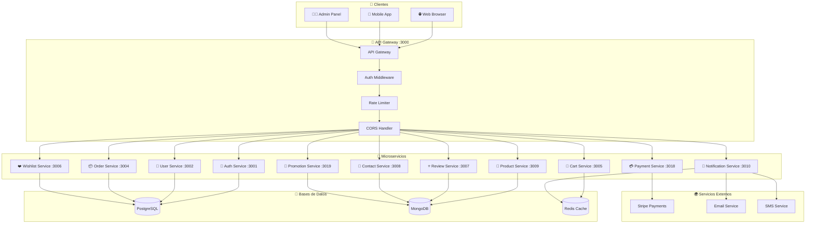

---

## 🔐 Auth Service - Flujo de Autenticación

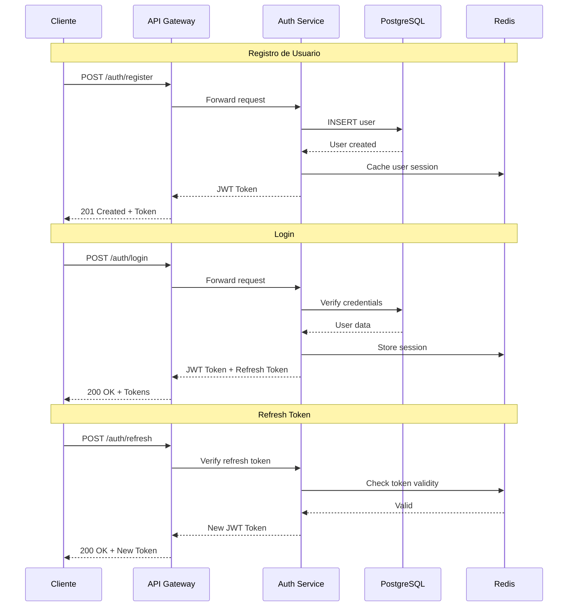

---

## 🌸 Product Service - Gestión de Productos

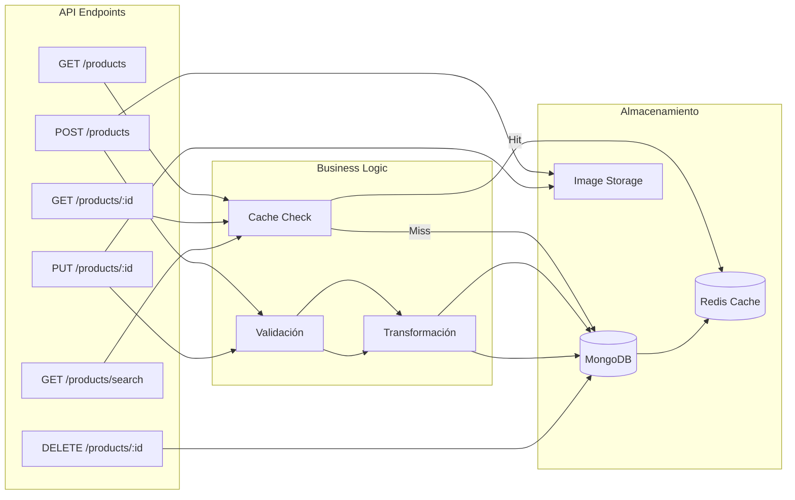

### Modelo de Producto

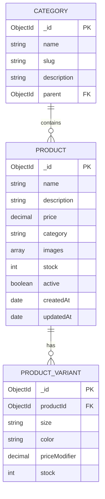

---

## 🛒 Cart Service - Carrito de Compras

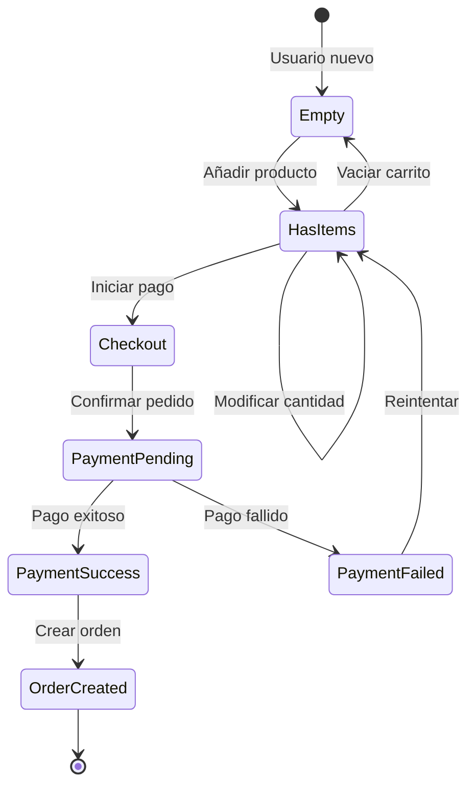

### Estructura del Carrito

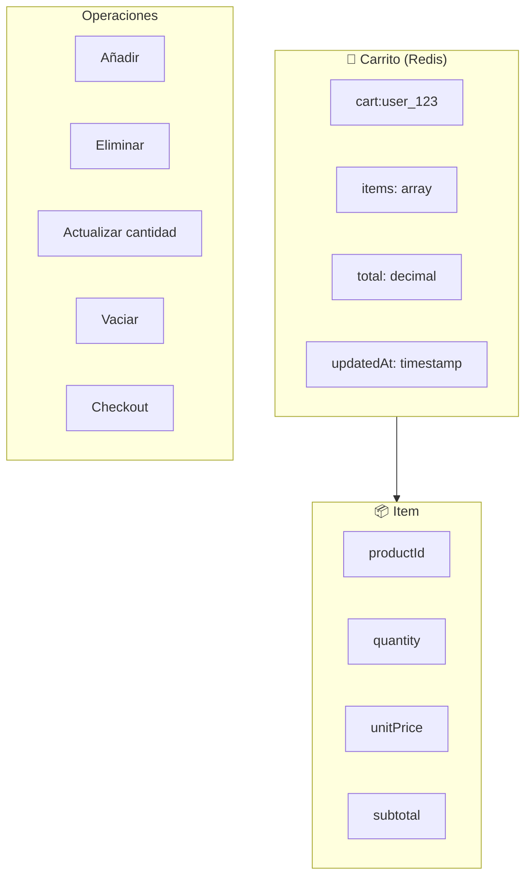

---

## 📦 Order Service - Gestión de Pedidos

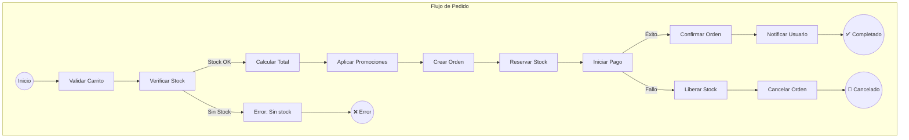

### Estados del Pedido

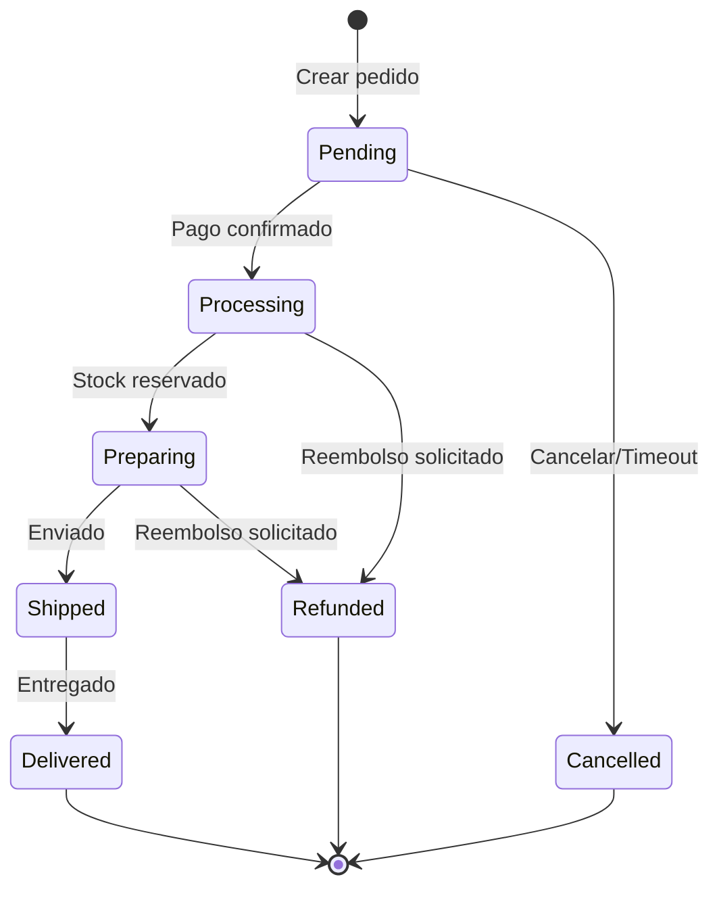

---

## 💳 Payment Service - Procesamiento de Pagos

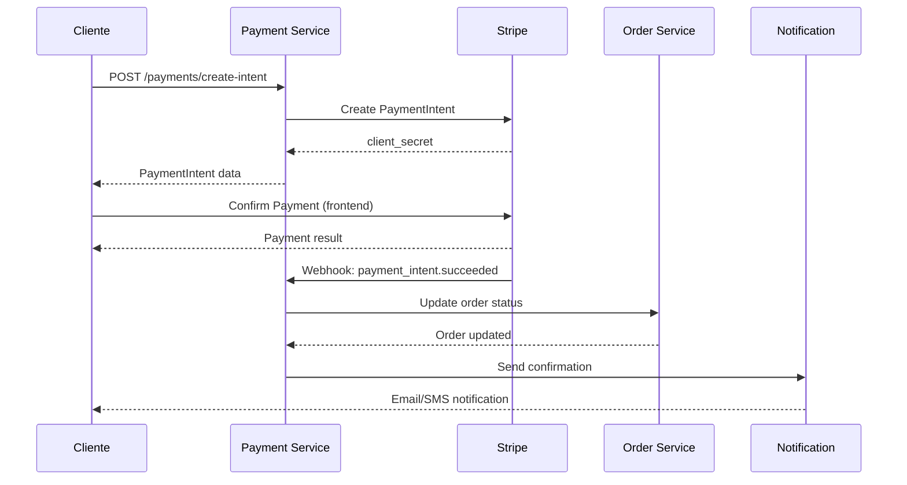

---

## 🔔 Notification Service - Sistema de Notificaciones

```mermaid
flowchart LR
    subgraph Triggers["🎯 Disparadores"]
        ORDER_CREATED[Pedido Creado]
        PAYMENT_OK[Pago Exitoso]
        SHIPPED[Pedido Enviado]
        DELIVERED[Entregado]
        PROMO[Nueva Promoción]
    end

    subgraph Queue["📬 Cola de Mensajes"]
        REDIS_QUEUE[(Redis Queue)]
    end

    subgraph Channels["📤 Canales"]
        EMAIL[📧 Email]
        SMS[📱 SMS]
        PUSH[🔔 Push]
        WEBHOOK[🔗 Webhook]
    end

    subgraph Templates["📝 Templates"]
        T1[order_confirmation]
        T2[payment_receipt]
        T3[shipping_update]
        T4[delivery_confirm]
    end

    Triggers --> REDIS_QUEUE
    REDIS_QUEUE --> Templates
    Templates --> Channels
```

---

## 🎁 Promotion Service - Gestión de Promociones

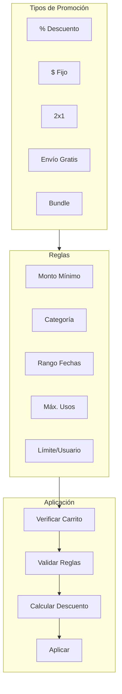

---

## 🗄️ Modelo de Datos Completo

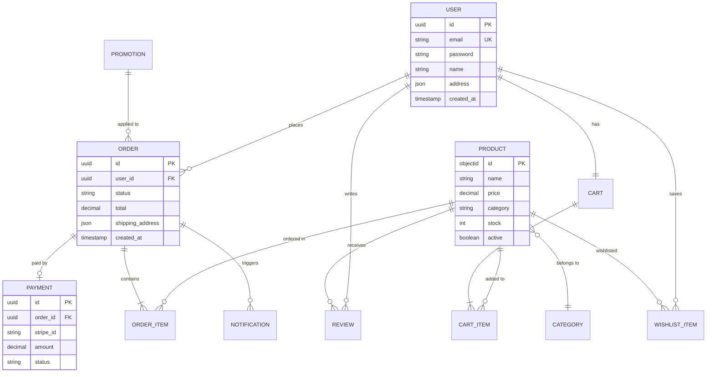

---

## 🚀 Deployment en Railway

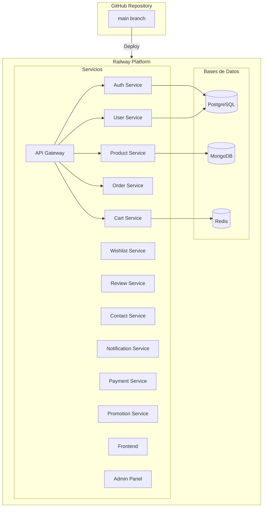

---

## 📈 Métricas y Monitoreo

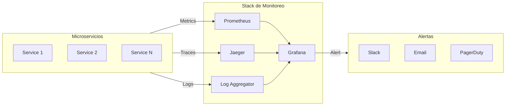

---

*Diagramas generados con Mermaid - Diciembre 2025*
