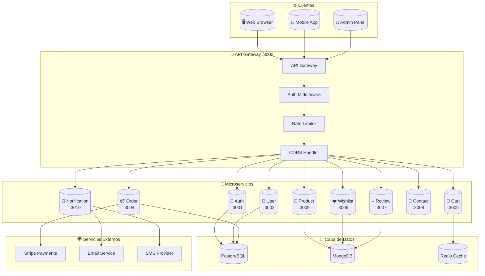
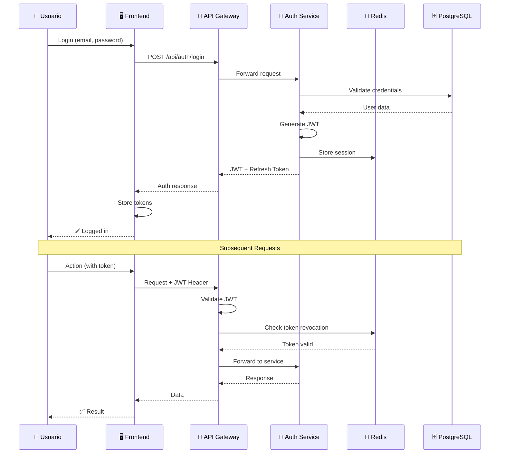
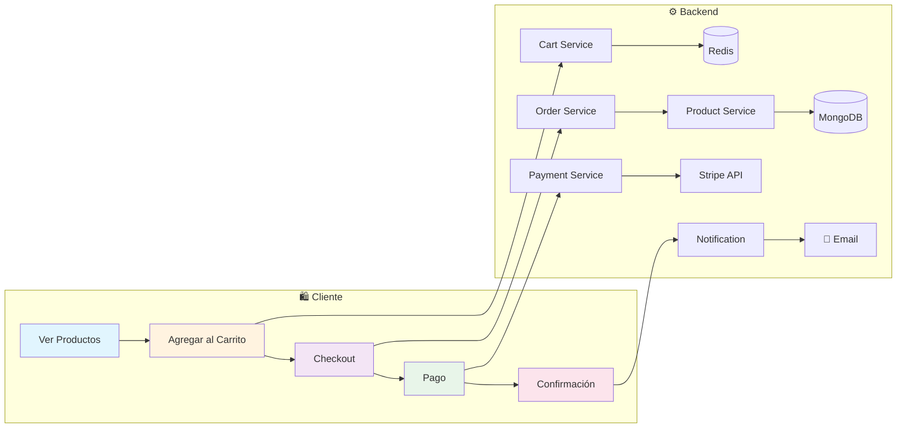
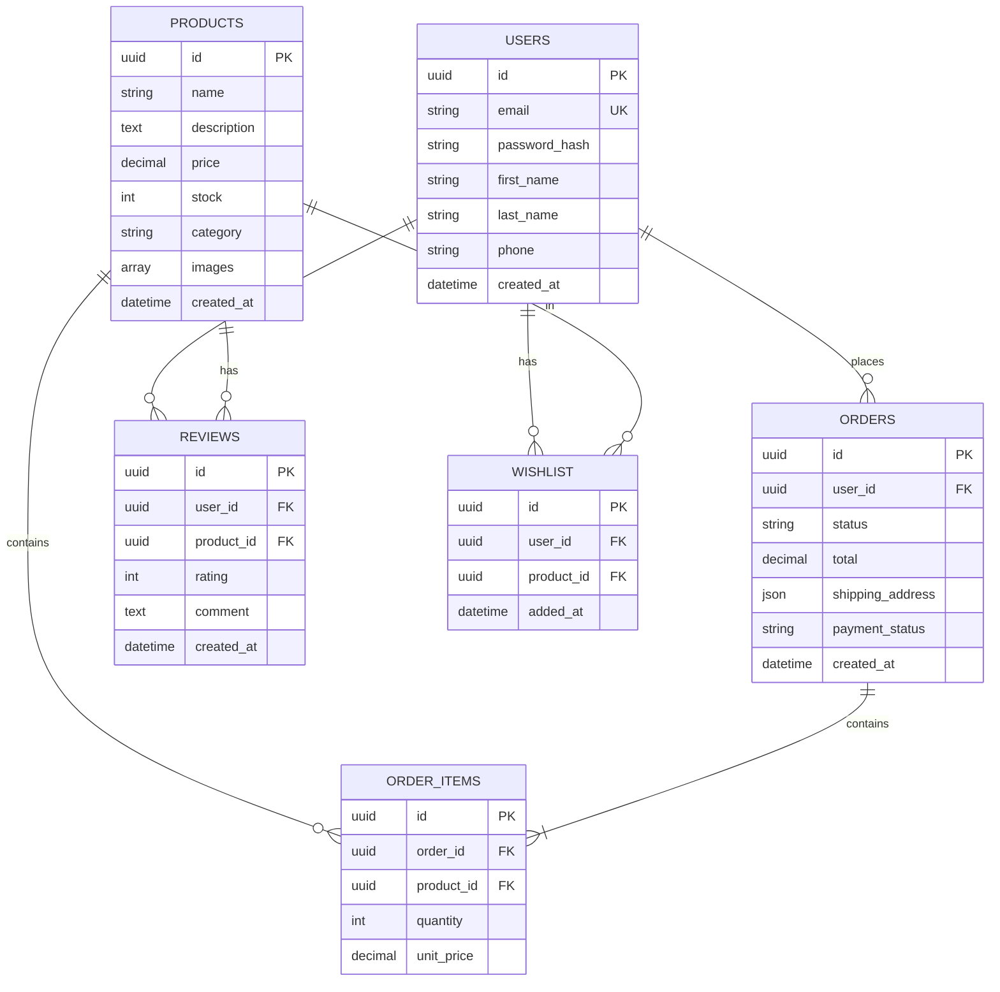
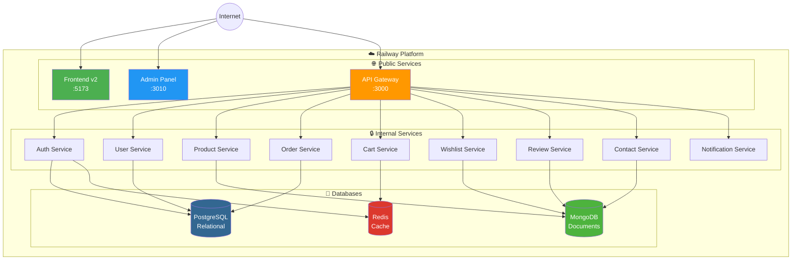
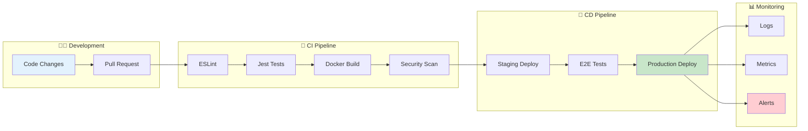
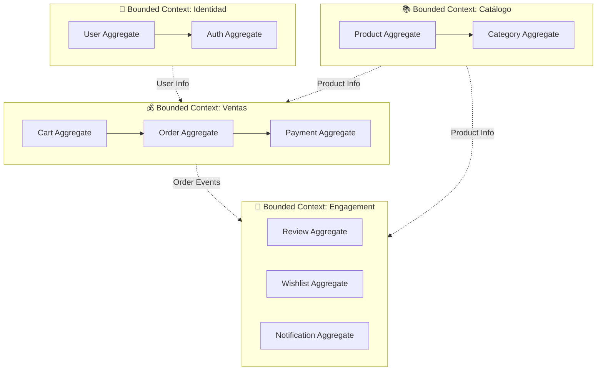

# 📊 Diagramas de Arquitectura - Flores Victoria

## 1. Arquitectura General de Microservicios



## 2. Flujo de Autenticación



## 3. Flujo de Compra (Checkout)



## 4. Arquitectura de Datos



## 5. Infraestructura Railway



## 6. Pipeline CI/CD



## 7. Modelo de Dominio (DDD)



---

## 🎨 Cómo Visualizar estos Diagramas

### Opción 1: GitHub (Automático)
GitHub renderiza Mermaid automáticamente. Solo sube este archivo.

### Opción 2: VS Code
Instala la extensión "Markdown Preview Mermaid Support"

### Opción 3: Online
Copia el código Mermaid a: https://mermaid.live

### Opción 4: Exportar como imagen
```bash
npm install -g @mermaid-js/mermaid-cli
mmdc -i architecture-diagrams.md -o diagrams.png
```

---

*Generado el 24 de Diciembre 2025*
*Proyecto: Flores Victoria E-commerce Platform*
