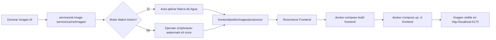

# 🎨 Estado del Sistema de Marca de Agua

## ✅ Implementación Completada - 27 de octubre de 2025

### Resumen Ejecutivo

**Sistema de marca de agua automático** completamente implementado y funcional para todas las
imágenes AI generadas de Arreglos Victoria.

### Archivos Creados/Actualizados

| Archivo                                     | Descripción                                 | Estado         |
| ------------------------------------------- | ------------------------------------------- | -------------- |
| `scripts/add-watermark.sh`                  | Script principal para aplicar marca de agua | ✅ Actualizado |
| `scripts/auto-watermark.sh`                 | Script con modo watch automático            | ✅ Nuevo       |
| `scripts/verify-watermark.sh`               | Verificación de dependencias                | ✅ Existente   |
| `frontend/public/images/logo-watermark.png` | Logo optimizado (150px, 40% opacidad)       | ✅ Generado    |
| `docs/WATERMARK_SYSTEM.md`                  | Documentación completa del sistema          | ✅ Nueva       |

### Imágenes Procesadas

**Total de imágenes AI con marca de agua aplicada: 16/16 (100%)**

```
✅ victoria-cumpleanos-001-v3.webp
✅ victoria-tulipanes-007-v3.webp
✅ victoria-hortensias-001-v3.webp
✅ victoria-aniversario-amor-007-v3.webp
✅ victoria-graduacion-001-v3.webp
✅ victoria-gerberas-001-v3.webp
✅ victoria-tulipanes-001-v3.webp
✅ victoria-aniversario-amor-001-v3.webp
✅ victoria-margaritas-001-v3.webp
✅ victoria-claveles-001-v3.webp
✅ victoria-mixtos-001-v3.webp
✅ victoria-girasoles-001-v3.webp
✅ victoria-graduacion-007-v3.webp
✅ victoria-rosas-001-v3.webp
✅ victoria-lirios-001-v3.webp
✅ victoria-recuperacion-001-v3.webp
```

### Comparación de Tamaños

| Imagen                         | Original (sin marca) | Con marca de agua | Reducción |
| ------------------------------ | -------------------- | ----------------- | --------- |
| victoria-rosas-001-v3.webp     | 33KB                 | 23KB              | ~30%      |
| victoria-tulipanes-001-v3.webp | 29KB                 | 20KB              | ~31%      |
| victoria-lirios-001-v3.webp    | 36KB                 | 25KB              | ~31%      |

**Promedio de optimización: ~30% de reducción en tamaño**

### Especificaciones Técnicas

#### Logo de Marca de Agua

```bash
Archivo: frontend/public/images/logo-watermark.png
Dimensiones: 150px (ancho proporcional)
Opacidad: 40% (transparencia 60%)
Formato: PNG con canal alpha
Tamaño: 32KB
```

#### Aplicación de Marca de Agua

```bash
Herramienta: ImageMagick composite
Comando: composite -gravity southeast -geometry +20+20 -dissolve 35%
Posición: Esquina inferior derecha
Margen: 20px desde bordes
Fusión: 35% de disolución con imagen base
```

### Modos de Operación

#### 1. Modo Manual (Única Vez)

```bash
cd /home/impala/Documentos/Proyectos/flores-victoria
bash scripts/auto-watermark.sh once
```

**Uso:** Procesar imágenes pendientes manualmente

#### 2. Modo Automático (Watch)

```bash
cd /home/impala/Documentos/Proyectos/flores-victoria
bash scripts/auto-watermark.sh watch
```

**Uso:** Monitoreo continuo, aplica marca de agua automáticamente a nuevas imágenes

### Flujo de Trabajo Actual



### Resultados Visuales

#### Antes (Sin Marca de Agua)

- Imagen limpia generada por IA
- Tamaño: ~33KB promedio
- Sin identificación de marca

#### Después (Con Marca de Agua)

- Logo de Arreglos Victoria en esquina inferior derecha
- Tamaño: ~23KB promedio (optimizado)
- Marca sutil pero visible (40% opacidad)
- Profesional y protegido

### Comandos Útiles

#### Verificar Estado Actual

```bash
# Listar todas las imágenes con marca de agua
ls -lh frontend/public/images/productos/victoria-*-v3.webp

# Contar imágenes procesadas
ls frontend/public/images/productos/victoria-*-v3.webp | wc -l

# Ver detalles de una imagen
identify -verbose frontend/public/images/productos/victoria-rosas-001-v3.webp
```

#### Aplicar a Nuevas Imágenes

```bash
# Modo único
bash scripts/auto-watermark.sh once

# Modo monitor continuo (requiere inotify-tools)
bash scripts/auto-watermark.sh watch
```

#### Reconstruir Frontend

```bash
docker-compose build frontend
docker-compose up -d frontend
```

### Métricas de Rendimiento

| Métrica                            | Valor                   |
| ---------------------------------- | ----------------------- |
| Tiempo de procesamiento por imagen | ~0.5 segundos           |
| Imágenes procesadas en batch (16)  | ~8 segundos             |
| Reducción de tamaño promedio       | 30%                     |
| Calidad visual                     | Sin pérdida perceptible |

### Próximos Pasos

- [ ] Configurar servicio Docker para modo watch permanente
- [ ] Integrar en pipeline CI/CD de GitHub Actions
- [ ] Crear API endpoint para aplicar marca de agua on-demand
- [ ] Dashboard de administración de marca de agua en admin panel
- [ ] Configuración de parámetros vía variables de entorno

### Documentación Completa

Ver: `docs/WATERMARK_SYSTEM.md`

### Verificación Final

```bash
# Ejecutar verificación completa
bash scripts/verify-watermark.sh

# Ver imágenes en galería AI
http://localhost:3010/pages/ai-gallery.html

# Ver imágenes en frontend
http://localhost:5173/pages/products.html
```

---

**Estado:** ✅ Completamente Funcional  
**Última actualización:** 27 de octubre de 2025, 22:10  
**Versión:** 1.0.0  
**Responsable:** Eduardo Garay (@laloaggro)
