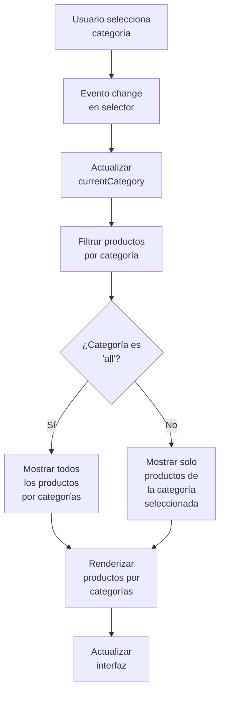

# Proceso de Filtrado por Categorías

## Diagrama de Flujo de Filtrado



## Proceso Detallado

### 1. Selección de Categoría
Cuando el usuario selecciona una categoría en el dropdown:
- Se dispara un evento `change` en el selector
- Se actualiza la propiedad `currentCategory` en el componente

### 2. Filtrado de Productos
La función `filterAndPaginateProducts()` filtra los productos:
- Compara la categoría del producto con la categoría seleccionada
- Utiliza el mapeo de categorías para hacer coincidir nombres en inglés con español

### 3. Renderizado Condicional
Dependiendo de la categoría seleccionada:
- Si es "all": Se muestran todos los productos organizados por categorías
- Si es una categoría específica: Se muestran solo los productos de esa categoría

### 4. Actualización de Interfaz
Se actualiza la vista con los productos filtrados y se muestra al usuario.

## Código Relacionado

### Mapeo de Categorías
```javascript
this.categoryMapping = {
  'bouquets': 'Ramos',
  'arrangements': 'Arreglos',
  'wreaths': 'Coronas',
  'supplies': 'Insumos',
  'accessories': 'Accesorios',
  'condolences': 'Condolencias',
  'gardening': 'Jardinería'
};
```

### Función de Filtrado
```javascript
filterAndPaginateProducts() {
  this.filteredProducts = this.allProducts.filter(product => {
    const matchesSearch = !this.searchTerm || 
      product.name.toLowerCase().includes(this.searchTerm) ||
      (product.description && product.description.toLowerCase().includes(this.searchTerm));
    
    // Usar el mapeo de categorías para comparar correctamente
    const productCategory = this.categoryMapping[product.category] || product.category;
    const matchesCategory = this.currentCategory === 'all' || 
      productCategory === this.currentCategory;
    
    return matchesSearch && matchesCategory;
  });
  
  // Mostrar productos organizados por categorías si no hay filtro de categoría ni búsqueda
  if (this.searchTerm === '' && this.currentCategory === 'all') {
    this.renderProductsByCategory();
  } else {
    // Mostrar productos filtrados normalmente
    this.renderFilteredProducts();
  }
}
```