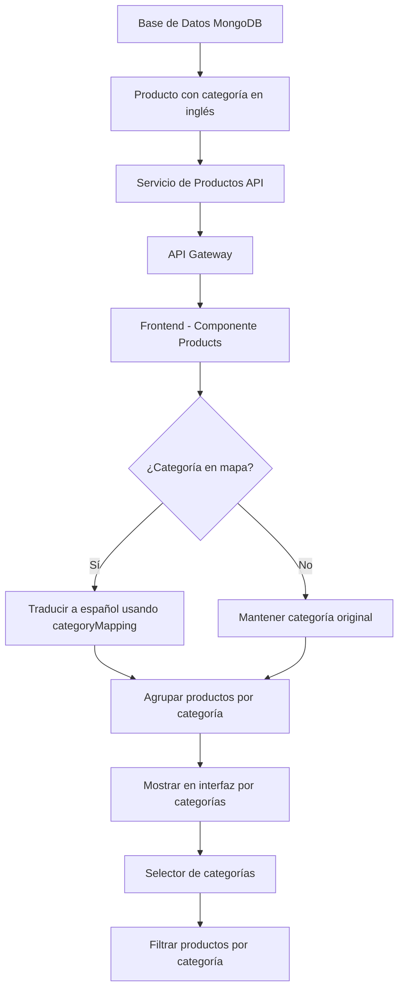

# Diagrama de Flujo: Categorías de Productos

## Flujo de datos de categorías desde la BD hasta la interfaz



## Descripción Detallada

### 1. Base de Datos

Los productos se almacenan en MongoDB con categorías en inglés:

- `bouquets` (Ramos)
- `arrangements` (Arreglos)
- `wreaths` (Coronas)
- `supplies` (Insumos)
- `accessories` (Accesorios)

### 2. API de Productos

El microservicio de productos expone una API REST que devuelve los productos con sus categorías en
inglés.

### 3. API Gateway

Actúa como punto de entrada único para todas las solicitudes de microservicios.

### 4. Frontend - Componente Products

En el componente de productos se implementa un mapeo de categorías:

```javascript
this.categoryMapping = {
  bouquets: 'Ramos',
  arrangements: 'Arreglos',
  wreaths: 'Coronas',
  supplies: 'Insumos',
  accessories: 'Accesorios',
  condolences: 'Condolencias',
  gardening: 'Jardinería',
};
```

### 5. Proceso de Visualización

1. Se cargan todos los productos desde la API
2. Se agrupan por categoría usando el mapeo
3. Se muestran en la interfaz organizados por categorías
4. El usuario puede filtrar por categoría usando el selector

### 6. Proceso de Filtrado

1. El usuario selecciona una categoría en el selector
2. Se filtran los productos que coinciden con esa categoría
3. Se actualiza la visualización con los productos filtrados
