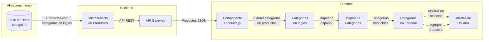

# Diagrama Detallado de Flujo: Categorías de Productos

## Flujo Completo del Sistema

```mermaid
graph LR
    subgraph "Almacenamiento"
        A[(Base de Datos<br/>MongoDB)]
    end

    subgraph "Backend"
        B[Microservicio<br/>de Productos]
        C[API Gateway]
    end

    subgraph "Frontend"
        D[Componente<br/>Products.js]
        E[Categorías<br/>en Inglés]
        F[Mapeo de<br/>Categorías]
        G[Categorías<br/>en Español]
        H[Interfaz de<br/>Usuario]
    end

    A -- "Productos con<br/>categorías en inglés" --> B
    B -- "API REST" --> C
    C -- "Productos JSON" --> D
    D -- "Extraer categorías<br/>de productos" --> E
    E -- "Mapear a<br/>español" --> F
    F -- "Categorías<br/>traducidas" --> G
    G -- "Mostrar en<br/>selector" --> H
    G -- "Agrupar<br/>productos" --> H
```
